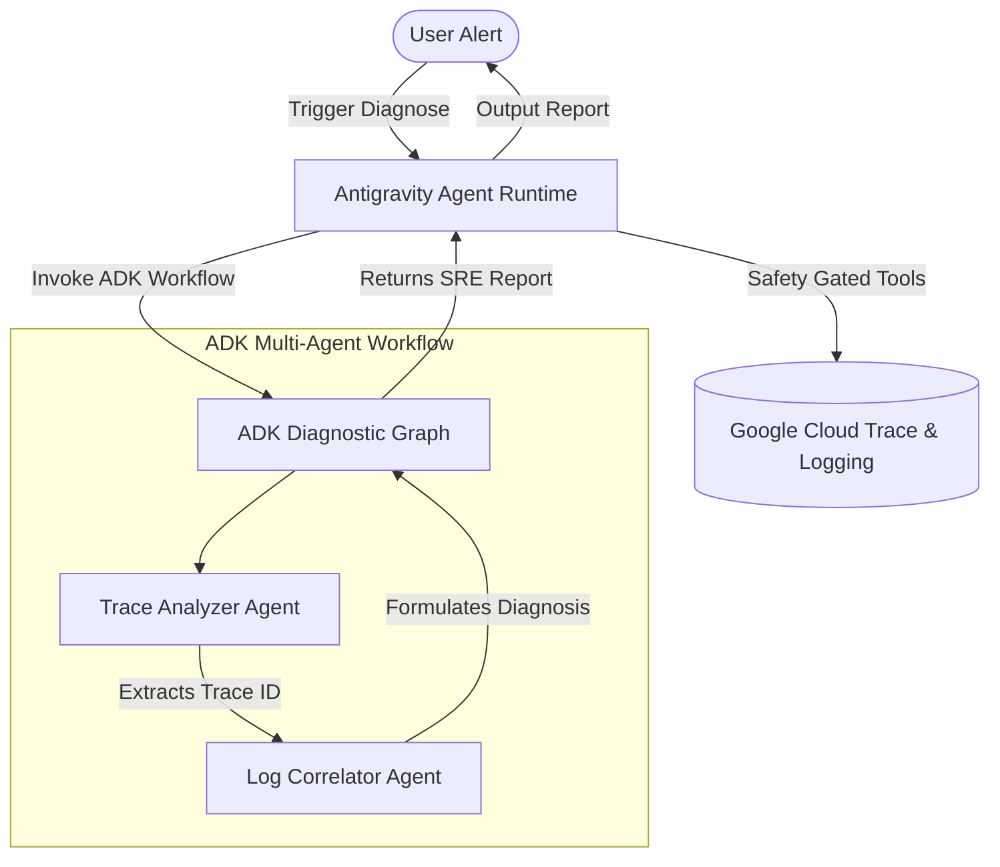

# Taming the 3 AM Alert: Building an Autonomous SRE Agent using Google ADK, Antigravity SDK, and `uv`

Triaging production incidents at 3 AM is one of the most stressful parts of being a software developer or site reliability engineer (SRE). In modern distributed systems, this is amplified by cognitive overload: logs are scattered across dozens of microservices, trace paths are nested and hard to follow, and identifying the true root cause requires manually correlating timestamps across disparate observability dashboards.

*What if an autonomous AI assistant could correlate trace timelines, identify bottlenecks, generate detailed root-cause summaries, and write the incident post-mortem for you before you even log on?*

In this post, we introduce a complete blueprint for building and deploying an **Autonomous SRE Agent in Google Cloud**. This system combines two powerful Google frameworks: the **Agent Development Kit (ADK)** for multi-agent diagnostic graphs, and the **Google Antigravity SDK** for runtime sandboxing, safety policies, and local simulation.

---

## 🏗️ The Core Architecture: Orchestration + Safety

To build a reliable SRE assistant, we must solve two distinct problems: **reasoning orchestration** (mapping diagnostic workflows) and **environmental safety** (restricting agent actions to read-only APIs by default). Our blueprint splits these responsibilities:



1. **Google ADK (Diagnostic Workflow)**:
   The ADK is a code-first library designed for multi-agent systems. We construct a pipeline containing:
   * **Trace Analyzer Agent**: Scans recent trace logs, filters transactions by latency (>5000ms) or error status, and isolates the failing `traceId`.
   * **Log Correlator Agent**: Queries logs tagged with the target `traceId`, correlates stack traces, and compiles the root cause.
2. **Google Antigravity SDK (Sandboxed Runtime)**:
   The Antigravity SDK handles OS and cloud access, wires Python functions into LLM tools, and enforces safety gates. Using `LocalAgentConfig` in [config.py](file:///home/xsavikx/AntigravityProjects/sre-agent/agent/src/agent/config.py), we enforce a **least-privilege "deny-by-default" policy**. The agent is restricted to read-only telemetry queries and must prompt for explicit user confirmation (`ask_user("run_command")`) before executing any write/mutate actions.

---

## 🔬 Deep Dive: Multi-Service Cascade Latency & Bottleneck Analysis

When an alert triggers, tracing dashboards show a slow parent request, but that is often a red herring. The latency usually cascades from a downstream microservice. 

To automate cascade analysis, we implemented a custom tool: [analyze_trace_cascade](file:///home/xsavikx/AntigravityProjects/sre-agent/sre_agent/src/sre_agent/gcp_tools.py#L940). 

It builds a span parent-child hierarchy map and calculates:
* **Inclusive Duration**: The total wall-clock time of the span (including child calls).
* **Exclusive (Self) Duration**: The active execution time of the span (excluding child calls):
  $$\text{ExclusiveTime} = \text{InclusiveTime} - \sum \text{ChildInclusiveTimes}$$

Using this formulation, the tool isolates the exact service bottleneck contributing the highest percentage to the overall latency. It outputs a structured markdown table:

```
### 🔍 Span Latency Breakdown
| Service / Span Name | Span ID | Parent ID | Status | Inclusive Time | Exclusive (Self) Time | Contribution |
| :--- | :--- | :--- | :--- | :--- | :--- | :--- |
| `/api/gateway` | `span-gateway-111` | `None` | ERROR | 10270 ms | 20 ms | 0.2% |
| └── `/api/backend` | `span-backend-222` | `span-gateway-111` | ERROR | 10250 ms | 50 ms | 0.5% |
|     └── `/api/database` | `span-database-333` | `span-backend-222` | ERROR | 10200 ms | 10200 ms | 99.3% |

### 🚨 Identified Bottleneck
*   **Bottleneck Span**: `/api/database` (`span-database-333`)
*   **Self-Execution Time**: `10200 ms` (99.3% of total trace)
*   **Status**: `ERROR`
```

---

## 📄 Automated Incident Post-Mortem & Downloader

After diagnosing the root cause, the SRE Agent compiles an **Incident Post-Mortem**. Rather than generating a simple summary, it drafts a complete Markdown document covering:
* **Incident Overview**: Date/time, root service, Trace ID, and total impact duration.
* **Timeline**: Interactive breakdown from initial client entry, downstream DB connection attempts, timeout limits, up to agent diagnosis.
* **RCA (Root Cause Analysis)**: Deep analysis identifying the failure mechanism (e.g., firewall rule block, container resource exhaustion, or chaos monkey experiments).
* **Prevention Plan**: Immediate remediation (e.g., termination of chaos monkeys) and long-term preventions (e.g., circuit breakers, shorter timeouts).

### Interactive Chat Export
To make this document immediately useful, the Web UI uses [a2ui_translator.py](file:///home/xsavikx/AntigravityProjects/sre-agent/agent/src/agent/a2ui_translator.py) to translate the raw markdown report into structured UI elements. When it detects a post-mortem section, it appends a premium **Download Button** to the chat bubble.

This button is styled with custom HSL transitions, shadows, and translateY micro-animations. On click, it triggers a client-side Blob downloader:
```javascript
const blob = new Blob([comp.content], { type: 'text/markdown' });
const url = URL.createObjectURL(blob);
const a = document.createElement('a');
a.href = url;
a.download = comp.filename || 'post_mortem.md';
document.body.appendChild(a);
a.click();
```
Developers can export the post-mortem report to markdown with a single click and commit it directly to their internal post-incident review wiki.

---

## 🔒 Least-Privilege IAM Deployment

In a production GCP environment, giving an AI agent unrestricted access is a severe security risk. To enforce least privilege, our deployment pipeline ([deploy.sh](file:///home/xsavikx/AntigravityProjects/sre-agent/deploy.sh)) deploys the microservices to **Google Cloud Run** using separate, restricted service accounts:

1. **Target Application Identity** (`sre-chaos-monkey-sa`): Runs the instrumented FastAPI app. It is limited to **write-only** telemetry roles:
   * `roles/cloudtrace.agent` (Send spans to Cloud Trace)
   * `roles/logging.logWriter` (Stream logs to Cloud Logging)
2. **SRE Agent Identity** (`sre-agent-sa`): Runs the diagnostics agent. It is limited to **read-only** telemetry roles:
   * `roles/cloudtrace.user` (Query and retrieve Trace details)
   * `roles/logging.viewer` (Filter logs by trace IDs)

---

## 🚀 Interactive Setup: Try it Yourself

You can execute the entire trace-scanning, log-correlating, bottleneck-analyzing, and post-mortem generation workflow locally using **`uv`**. No GCP account or credentials required!

### Step 1: Install uv and sync packages
```bash
pip install uv
uv sync --all-packages
```

### Step 2: Run the Incident Simulation
```bash
uv run simulate_incident.py
```
This script triggers a database timeout incident, writes mock traces and logs to the local `mock_telemetry_data/` directory, boots the SRE Agent in mock mode, executes the multi-agent ADK workflow, and prints the markdown diagnostic report directly to your terminal.

---

## 🔗 Project Resources

* **FastAPI Target Application**: Instrumented under the [app/](file:///home/xsavikx/AntigravityProjects/sre-agent/app) folder.
* **SRE Diagnostics Skill**: Core logic defined in [skills/sre_incident_solver/](file:///home/xsavikx/AntigravityProjects/sre-agent/skills/sre_incident_solver).
* **Tutorial Walkthrough**: Step-by-step blueprint setup in [CODELAB.md](file:///home/xsavikx/AntigravityProjects/sre-agent/CODELAB.md).
* **AI Collaborator Rules**: Coding guidelines in [AGENTS.md](file:///home/xsavikx/AntigravityProjects/sre-agent/AGENTS.md).
