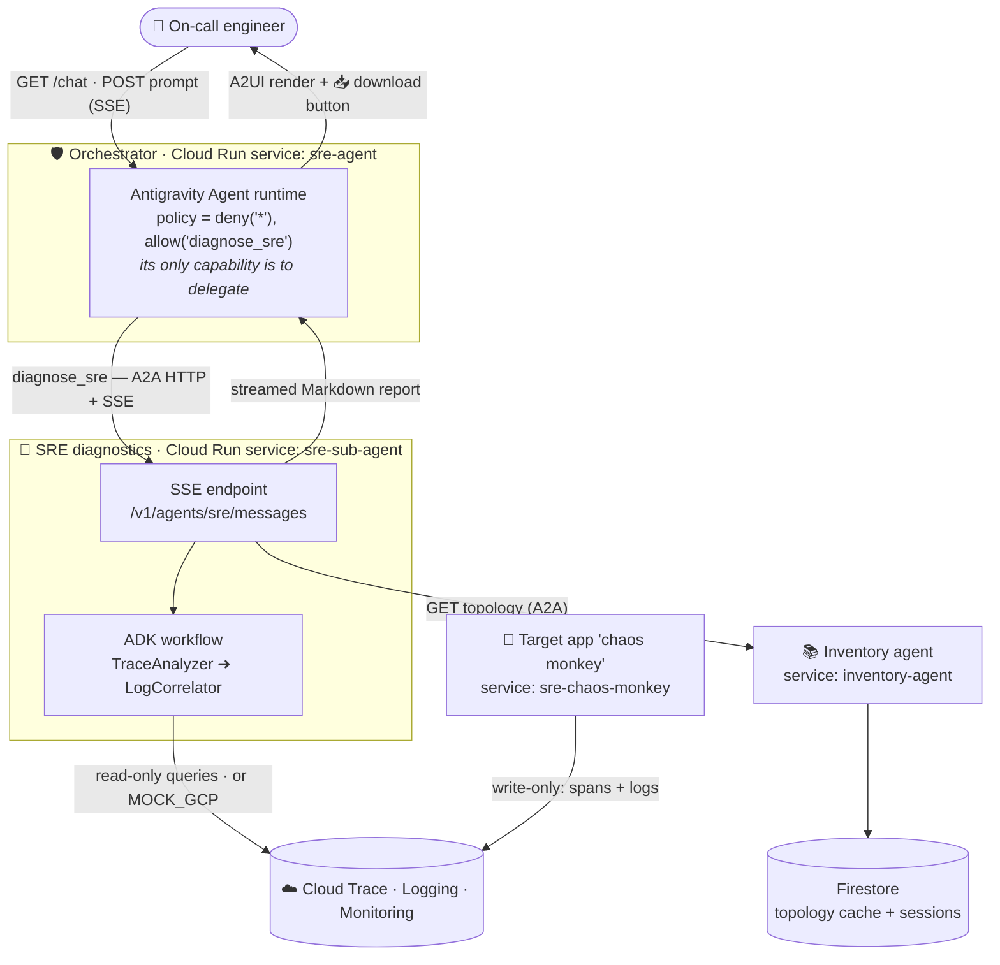
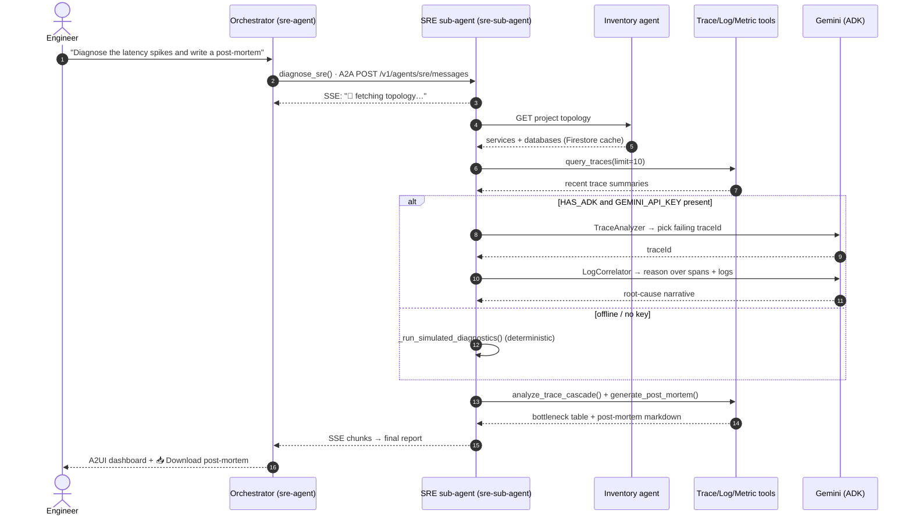
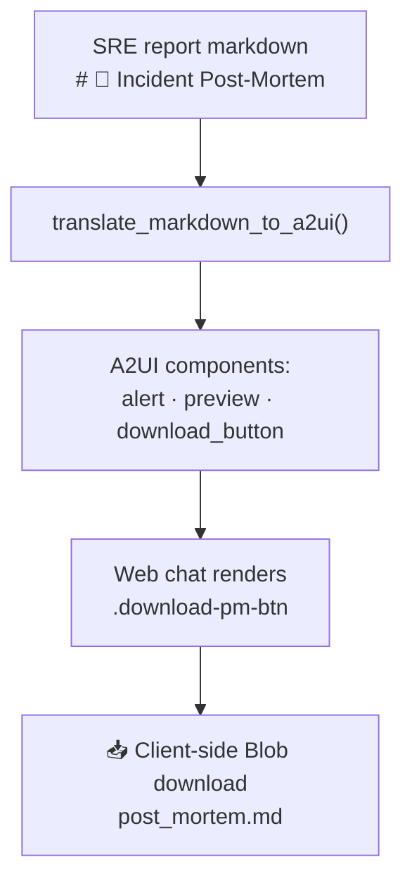
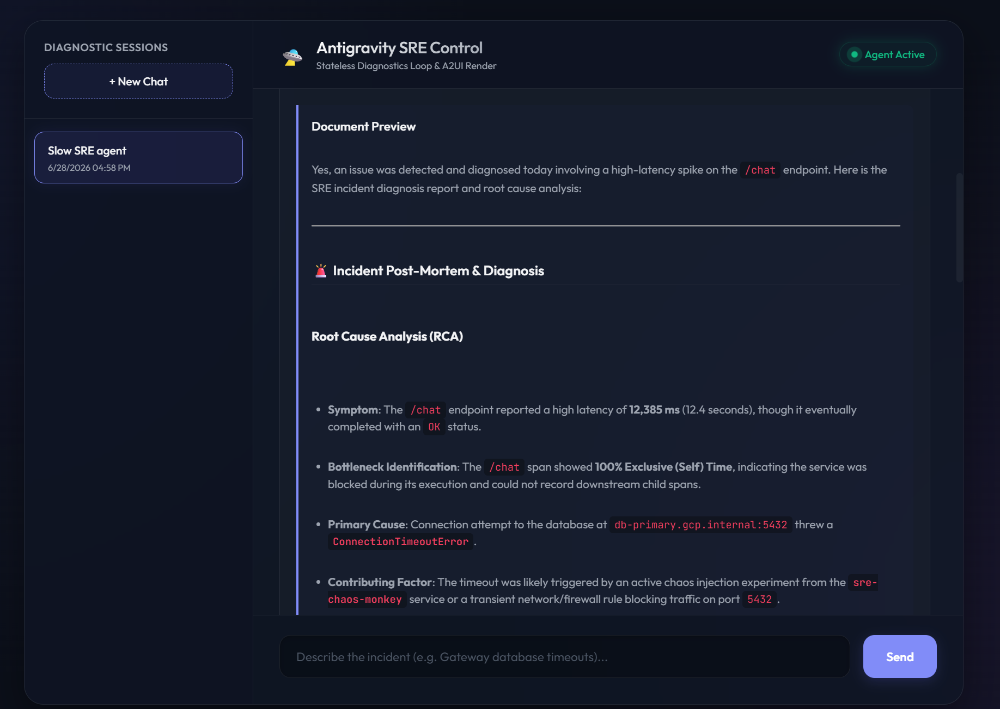
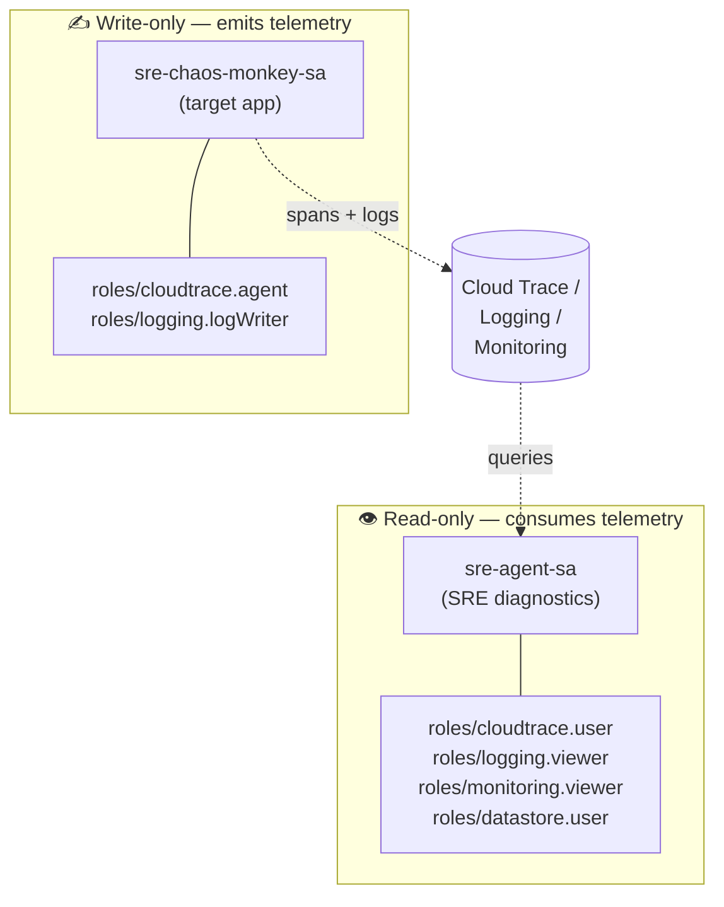

# Building an Autonomous SRE Agent with Google ADK and the Antigravity SDK

One of the most stressful parts of being an on-call engineer is triaging a production incident in
the middle of the night. Modern distributed systems amplify the pain with the extra cognitive
overload of, well, the distributed systems: logs scattered across dozens of microservices, deeply
nested trace paths, and half a dozen observability dashboards you have to correlate by hand.

Usually the setup makes total sense for the SREs who built it (maybe it's the cost, maybe it's
whichever tool the team knows best, maybe it's just optimizing for one particular concern), but it
piles a lot of load onto whoever is on call.

So in the era of AI, it makes sense to get some help from an autonomous, smart system that's
fine-tuned for your setup and remembers all the little bits and pieces specific to your
infrastructure.

This post is a complete, runnable blueprint for exactly that: an autonomous SRE agent on Google
Cloud you can host next to your main stack. I'm combining two Google frameworks that solve two very
different problems:

- the **Agent Development Kit (ADK)** for the multi-agent diagnostic _reasoning_, and
- the **Google Antigravity SDK** for the agent _runtime_ — tool wiring, deny-by-default safety
  policies, and local simulation.

The whole stack runs locally with **zero GCP credentials** thanks to a mock-telemetry mode, so you
can try it in under a minute. And everything below is verified against the code in the repo, no
hand-waving.

---

## The Core Architecture: Reasoning + Safety

A proper SRE assistant has to get two things right at the same time: **reasoning orchestration**
(which diagnostic step happens when) and **environmental safety** (the agent must never be able to
mutate production while it pokes around).

The blueprint splits those concerns across four small FastAPI services that talk to each other over
an [Agent-to-Agent (A2A) protocol](https://a2a-protocol.org/latest/), with results streamed back as
[Server-Sent Events (SSE)](https://developer.mozilla.org/en-US/docs/Web/API/Server-sent_events).



I'm using the Antigravity SDK for the Orchestrator, the front-facing agent. It gives you solid
safety gates out of the box and is smart enough to handle the user's requests directly. Its only
real capability is to delegate to the read-only SRE sub-agent, and that's enforced by a
deny-by-default policy:

```python
safety_policies = [
    deny("*"),            # nothing is allowed by default
    allow("diagnose_sre") # …except delegating to the SRE sub-agent
]
```

The config above basically gates whatever tools we want to allow for the agent to use.

The actual diagnostic work is done by Google ADK agents. ADK is a code-first library for
multi-agent graphs, and the SRE sub-agent runs a two-node graph:

- **TraceAnalyzer** scans recent trace summaries, filters for transactions that errored or breached
  the latency budget (>5000 ms), and isolates the single failing `traceId`.
- **LogCorrelator** pulls the spans and the logs tagged with that `traceId`, then reasons over them
  with a small toolbelt (metric queries, cascade analysis, post-mortem generation) to produce the
  root-cause report.

There's also a third agent: an inventory agent that gives the SRE aggregated knowledge of the
resources available in the GCP project. This grounds the diagnosis and keeps the agent focused on
the actual resources instead of wandering around too much.

> **Runs anywhere, credentials optional.** Every cloud dependency (`google-adk`, `google-antigravity`,
`google-cloud-*`, `opentelemetry`) is imported behind a `try/except ImportError` with a mock
fallback, and a `MOCK_GCP` flag swaps live API calls for local JSON fixtures. Same code path for the
local simulation and the Cloud Run deployment.

---

## Anatomy of a Diagnosis

When an alert fires, here's what actually happens end to end, from the on-call prompt to a finished
post-mortem. One thing worth calling out is the **two-tier reasoning**: with a real model key the
full ADK graph runs; offline it falls back to a deterministic simulated workflow that produces an
identically-structured report. So the demo behaves the same whether or not you have a Gemini key.



The Orchestrator does the one thing its policy allows: it hands the problem to the SRE sub-agent and
steps back. From there the sub-agent streams its progress back as Server-Sent Events, so the on-call
engineer watches the investigation unfold live instead of staring at a spinner.

It starts by pulling the project topology (which services exist, how they call each other, and where
their databases sit) from the Inventory agent's Firestore-backed cache. That map tells the diagnosis
where to look. Then it fetches the recent traces and runs them through the two-node graph:
TraceAnalyzer collapses thousands of spans down to the single failing trace worth investigating, and
LogCorrelator pulls every span and log line sharing that trace's ID to name the actual root cause.
Not just _"the database was slow,"_ but which span failed, with which error, and why.

Only then does it run the cascade analysis and draft the post-mortem, streaming the finished report
back through the Orchestrator to the chat UI, where it lands as a rendered dashboard with a one-click
download.

The nice thing about this setup is how extensible it is. Adding a new sub-agent or expanding an
existing tool is easy with ADK and the A2A protocol, so the blueprint grows with your infrastructure
instead of against it.

---

## Deep Dive: Cascade Latency & Bottleneck Analysis

In order to showcase the agent, I have also built another FastAPI service that emulates real
database errors with timeout exceptions and telemetry spans. As it is just a simulation, quite a lot
of actual problems are quite similar to this one, and frequently the initial gateway/backend latency
or errors are hidden downstream. But of course this is a textbook example still: a gateway request
that looks 10-second-slow, but where 99% of the time is actually trapped in a database call three
levels down.

```mermaid
gantt
    title Trace b49d… — Gateway request timeline (ms)
    dateFormat x
    axisFormat %Lms
    section /api/gateway
        inclusive 10270ms (self 20ms): crit, 0, 10270
    section /api/backend
        inclusive 10250ms (self 50ms): crit, 10, 10260
    section /api/database ⛔ timeout
        inclusive 10200ms (self 10200ms): crit, 30, 10230
```



The cascade-analysis tool builds the span parent/child map and computes, for every span:

- **Inclusive duration** — wall-clock time of the span including its children.
- **Exclusive (self) duration** — the active time spent _in that span alone_:

  $$\text{ExclusiveTime}(s) = \text{InclusiveTime}(s) - \sum_{c \in \text{children}(s)} \text{InclusiveTime}(c)$$

The span with the largest exclusive time is the true bottleneck. Here's the actual, verified output
from `uv run simulate_incident.py` (no edits, no GCP):

```text
### 🔍 Span Latency Breakdown
| Service / Span Name | Span ID            | Parent ID         | Status | Inclusive Time | Exclusive (Self) Time | Contribution |
| :---                | :---               | :---              | :---   | :---           | :---                  | :---         |
| /api/gateway        | span-gateway-111   | None              | ERROR  | 10270 ms       | 20 ms                 | 0.2%         |
|   └── /api/backend  | span-backend-222   | span-gateway-111  | ERROR  | 10250 ms       | 50 ms                 | 0.5%         |
|       └── /api/database | span-database-333 | span-backend-222 | ERROR | 10200 ms       | 10200 ms              | 99.3%        |

### 🚨 Identified Bottleneck
*   Bottleneck Span:     /api/database (span-database-333)
*   Self-Execution Time: 10200 ms (99.3% of total trace)
*   Status:              ERROR
*   Error Message:       ConnectionTimeoutError: Failed to connect to db-primary.gcp.internal:5432 after 10000ms
```

The gateway and backend both look "slow" at 10 s inclusive, but their _self_ time is a rounding
error. The agent ignores the noise and points straight at `/api/database`: 99.3% of the budget,
burned in a single connection timeout.

---

## Automated Post-Mortem & One-Click Export

Diagnosis is only half the job. The deliverable on-call engineers actually need is a post-mortem.
After the cascade analysis, a post-mortem generator drafts a complete Markdown document with an
Incident Overview (time, root service, Trace ID, impact duration), a Timeline, a Root Cause
Analysis, and a Prevention Plan, all populated from the real trace and log data.

That Markdown is then rendered through the [A2UI protocol](https://a2ui.org/):



A server-side translator spots the post-mortem heading and appends a download-button component; the
browser renders it as a styled button that builds the file entirely client-side (no server
round-trip) from the Markdown it already holds.

One click exports `post_mortem.md`, ready to drop into your incident-review wiki.

And here's how it actually looks in the deployed chat UI:



---

## Least-Privilege IAM on Cloud Run

Handing an autonomous agent unrestricted cloud access is a non-starter. The deploy pipeline gives
each Cloud Run service its **own service account** with the narrowest role set I could get away with:



The split is the whole point: the app that _generates_ the chaos can only ever **write** telemetry,
and the agent that _investigates_ it can only ever **read**. Neither can act on the other's plane.
(The deploy also provisions an `inventory-agent-sa` for topology discovery and a dedicated
`sre-build-sa` for Cloud Build, each scoped just as tightly.)

---

## Try It Yourself in 60 Seconds

The whole scan → correlate → analyze → post-mortem loop runs locally, with **no GCP account or
credentials required.**

```bash
# 1. Clone the repo
git clone https://github.com/xSAVIKx/sre-agent.git
cd sre-agent

# 2. Install uv and sync the workspace (app, agent, sre_agent, inventory_agent, sre_common)
pip install uv
uv sync --all-packages

# 3. Run the incident simulation
uv run simulate_incident.py
```

The simulation triggers a database-timeout incident in the target app, writes mock traces and logs
to `mock_telemetry_data/`, boots the Orchestrator in mock mode, runs the diagnostic workflow
in-process, and prints the report to your terminal. You'll see the structured telemetry logs (gateway
→ backend → database, ending in a `CRITICAL ConnectionTimeoutError`) followed by the full diagnosis:
the **99.3% `/api/database` bottleneck table** and the complete `# 🚨 Incident Post-Mortem` shown
above.

Want the full multi-service experience with the web chat UI? `docker-compose up --build` brings up
the Orchestrator, SRE agent, Inventory agent, a Firestore emulator, and the target app together, then
you open the chat at `/chat`.

---

## Project Resources

The complete, runnable source, plus a step-by-step [**CODELAB**](CODELAB.md) that builds this from
scratch, lives
on GitHub:

**👉 [github.com/xSAVIKx/sre-agent](https://github.com/xSAVIKx/sre-agent)**
