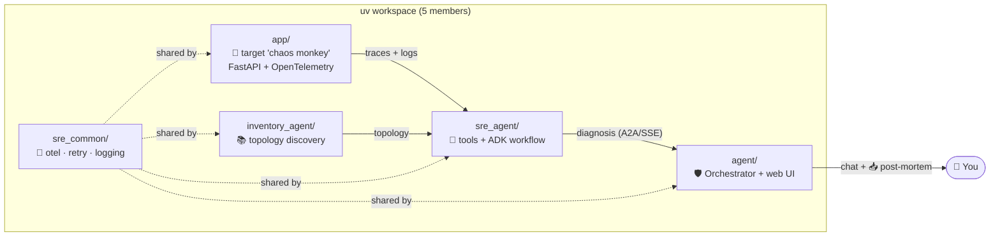
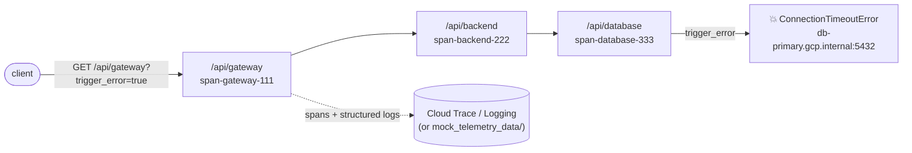
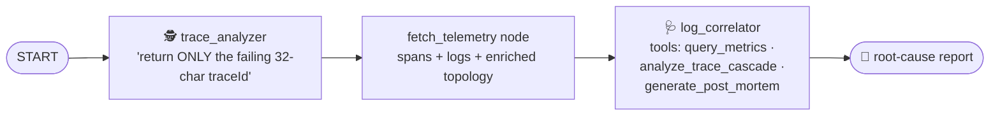
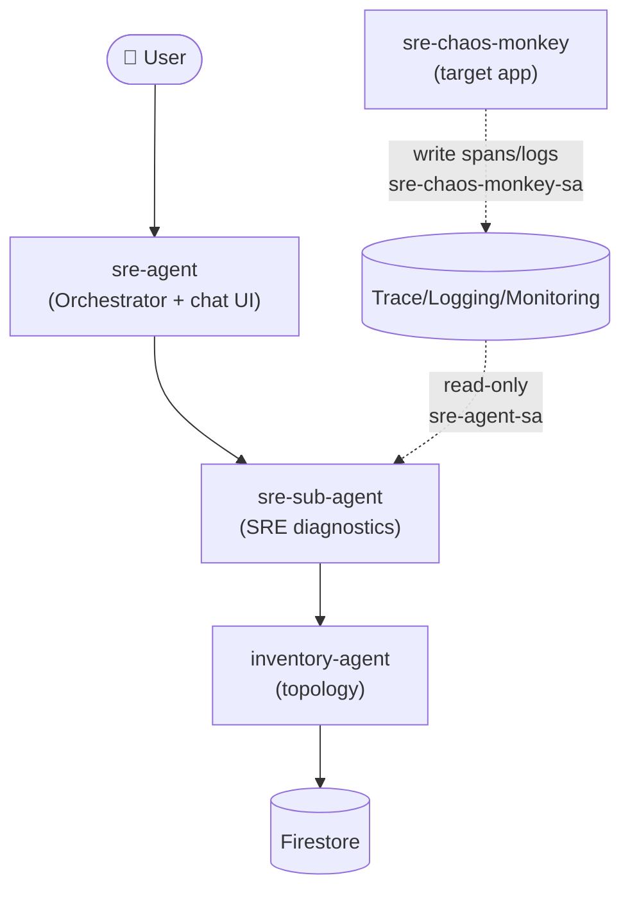

# Codelab: Build an Autonomous GCP SRE Agent (ADK + Antigravity with `uv`)

This hands-on codelab walks you through building an autonomous Site Reliability Engineering (SRE) agent that diagnoses distributed application failures and generates download-ready incident post-mortems — start to finish.

Every step builds the real, runnable packages in this repository, and the whole thing runs **locally with no GCP credentials** thanks to a mock-telemetry mode. The terminal output shown in Step 8 is the actual, verified output of the finished project.

> **A note on tooling:** the surrounding project is normally driven by the Antigravity CLI, but this codelab (and its prose/diagrams) is plain documentation — follow it with whatever editor or assistant you like, per [`AGENTS.md`](AGENTS.md).

---

## 🎯 What You Will Build



By the end you will have:

1. An instrumented **FastAPI target application** simulating a `Gateway → Backend → Database` call chain that emits OpenTelemetry traces and correlated logs.
2. A set of **custom SRE tools** that query Cloud Trace/Logging/Monitoring, perform cascade latency analysis, and generate post-mortems — each with a local mock fallback.
3. A **Google ADK multi-agent workflow** coordinating trace scanning and log correlation.
4. An **Antigravity SDK Orchestrator** that enforces a deny-by-default safety policy, translates Markdown reports into rich UI components, and serves a web chat.
5. An **interactive local simulation** and a **least-privilege Cloud Run deployment**.

---

## 🛠️ Prerequisites

- **Python 3.11+** (the codebase uses 3.14-style typing — `list[str]`, `str | None`).
- The **`uv`** package manager: `pip install uv`.
- *Optional, for cloud deployment only:* the **`gcloud` CLI** authenticated against a billing-enabled GCP project.

---

## Step 1: Bootstrap the `uv` Workspace

We use [`uv`](https://docs.astral.sh/uv/) workspaces for fast, isolated, cross-package dependency resolution. Create the root [`pyproject.toml`](pyproject.toml):

```toml
[project]
name = "sre-agent-codelab-workspace"
version = "0.1.0"
description = "SRE agent trace & log correlation codelab workspace"
readme = "README.md"
requires-python = ">=3.11"
dependencies = []

[tool.uv.workspace]
members = ["app", "agent", "sre_agent", "inventory_agent", "sre_common"]
```

Each member is its own package with its own `pyproject.toml`; the root file only defines the workspace. Create the shared virtual environment and link every package:

```bash
uv venv
uv sync --all-packages
```

> [!TIP]
> **Why `uv`?** It resolves and installs workspace dependencies far faster than `pip` + `venv`, and produces a single reproducible lockfile across all five packages.

---

## Step 2: The Shared Library (`sre_common`)

Cross-cutting concerns live in one place so every service behaves consistently. [`sre_common`](sre_common) exposes:

- `otel_trace` / `start_span` — OpenTelemetry decorators for spans.
- `retry_async` / `retry_sync` — exponential-backoff retries for flaky cloud calls.
- `setup_logging` — uniform structured logging.
- `TraceContextMiddleware` + `target_project_contextvar` — propagate the trace context and target project per request.

Anywhere in the stack you can simply:

```python
from sre_common import retry_async, otel_trace
```

We will lean on these in the tools and workflow that follow.

---

## Step 3: The Target Application (the "Chaos Monkey")

[`app/main.py`](app/main.py) is an OpenTelemetry-instrumented FastAPI app that simulates a three-tier request. A `trigger_error=true` query parameter injects a database connection timeout — the synthetic incident our agent will later diagnose.



In **mock mode** (`MOCK_GCP=true`, the default) the tiers call each other in-process and write synthetic trace/log JSON to `mock_telemetry_data/`. In **real mode** each tier propagates W3C `traceparent` headers to the next over HTTP and exports spans to Cloud Trace.

The key detail is how a mock span timeline is written — millisecond offsets must land in the **seconds + milliseconds** fields of the timestamp, or the downstream cascade math collapses:

```python
def _ts(ms: int) -> str:
    """10270 ms -> '2026-06-11T16:00:10.270Z' (NOT '...:00.10270Z')."""
    secs, millis = divmod(ms, 1000)
    return f"2026-06-11T16:00:{secs:02d}.{millis:03d}Z"

# On an injected error, the database tier dominates the budget:
db_duration      = 10200          # ~10s connection timeout
backend_duration = db_duration + 50
gateway_duration = backend_duration + 20
```

---

## Step 4: Custom SRE Tools

The Antigravity SDK turns plain Python functions into LLM tools by parsing their **type hints and docstrings** into a schema — so both are mandatory and must be precise. Tools register themselves via a decorator from [`sre_agent/registry.py`](sre_agent/src/sre_agent/registry.py):

```python
from typing import Any, Callable

class ToolRegistry:
    def __init__(self) -> None:
        self._tools: list[Callable[..., Any]] = []

    def register(self, func: Callable[..., Any]) -> Callable[..., Any]:
        if func not in self._tools:
            self._tools.append(func)
        return func

    def get_tools(self) -> list[Callable[..., Any]]:
        return self._tools

registry = ToolRegistry()

def register_tool(func: Callable[..., Any]) -> Callable[..., Any]:
    return registry.register(func)
```

All observability tools live in [`sre_agent/gcp_tools.py`](sre_agent/src/sre_agent/gcp_tools.py): `query_traces`, `get_trace_details`, `query_logs`, `query_logs_by_trace`, `query_metrics`, `list_metric_descriptors`, `analyze_trace_cascade`, and `generate_post_mortem`.

**Every tool must honor two non-negotiable patterns:** the `@register_tool` decorator, and an `if IS_MOCK:` branch that reads from `mock_telemetry_data/` instead of calling the cloud. Here is the heart of `analyze_trace_cascade` — the inclusive-vs-exclusive duration calculation that finds the true bottleneck:

```python
@register_tool
async def analyze_trace_cascade(trace_id: str, project_id: str | None = None) -> str:
    """Analyzes a trace to calculate inclusive vs exclusive duration for each span
    and locate the bottleneck.

    Args:
        trace_id: The unique hex string identifying the trace (32 characters).
        project_id: The GCP Project ID. If None, uses the default project.

    Returns:
        A Markdown report with the span hierarchy, self-execution time, and bottleneck.
    """
    details_str = await get_trace_details(trace_id, project_id)   # mock or live
    data = json.loads(details_str)
    spans = data.get("spans", [])

    # 1. Build the parent -> children map
    span_map = {s["spanId"]: s for s in spans}
    children_map = {s["spanId"]: [] for s in spans}
    for s in spans:
        parent_id = s.get("parentSpanId")
        if parent_id and parent_id in span_map:
            children_map[parent_id].append(s["spanId"])

    # 2. Inclusive duration = wall-clock time of the span (incl. children)
    inclusive = {s["spanId"]: _calculate_duration_ms(s["startTime"], s["endTime"]) for s in spans}

    # 3. Exclusive (self) duration = inclusive minus the sum of child inclusives
    exclusive = {}
    for s in spans:
        child_sum = sum(inclusive[c] for c in children_map[s["spanId"]])
        exclusive[s["spanId"]] = max(0, inclusive[s["spanId"]] - child_sum)

    # 4. The bottleneck is the span with the largest self-time
    bottleneck = max(exclusive, key=exclusive.get)
    # …format the hierarchy + bottleneck as a Markdown table…
```

The companion `generate_post_mortem` tool assembles a full RCA document headed by `# 🚨 Incident Post-Mortem` (that exact heading matters in Step 7).

---

## Step 5: The ADK Multi-Agent Workflow

[`sre_agent/sre_workflow.py`](sre_agent/src/sre_agent/sre_workflow.py) wires two specialized ADK agents into a graph. The `log_correlator` is handed the diagnostic toolbelt; the `trace_analyzer` only has to surface one ID.



```python
from google.adk import Agent as AdkAgent
from google.adk import Workflow as AdkWorkflow
from google.adk.workflow import node, START

trace_analyzer = AdkAgent(
    name="trace_analyzer",
    instruction=(
        "You are an SRE trace analyst. Locate the slowest or failing request "
        "and return ONLY the raw 32-character hex traceId — no extra text."
    ),
    model="gemini-3-flash-preview",
)

log_correlator = AdkAgent(
    name="log_correlator",
    instruction=(
        "You are a senior SRE debugging assistant. Identify the failing span, "
        "the root cause (timeouts, resource exhaustion, logic errors), and a "
        "mitigation plan. Use your tools for metrics, cascade analysis, and post-mortems."
    ),
    tools=[query_metrics, list_metric_descriptors, analyze_trace_cascade, generate_post_mortem],
    model="gemini-3-flash-preview",
)

sre_diagnostics_workflow = AdkWorkflow(
    name="sre_diagnostics_workflow",
    edges=[(START, trace_analyzer, fetch_telemetry, log_correlator)],
)
```

The public entrypoint `run_sre_diagnostics` selects between **two tiers** so the project always produces a report — with or without a model key:

```python
async def run_sre_diagnostics(traces_json: str, project_id: str | None = None) -> str:
    # …short-circuit to a clean "all healthy" report if no error/slow traces…
    if HAS_ADK and "GEMINI_API_KEY" in os.environ:
        return await _run_adk_diagnostics(traces_json, project_id)   # real Gemini reasoning
    return await _run_simulated_diagnostics(traces_json, project_id)  # deterministic, offline
```

Both tiers emit the same report structure (RCA → metrics → cascade table → post-mortem), so the UI and tests don't care which one ran.

---

## Step 6: The Orchestrator & Safety Policy

The user never talks to the SRE engine directly. They talk to a thin **Orchestrator** ([`agent/src/agent/config.py`](agent/src/agent/config.py)) whose entire job is to delegate — and whose Antigravity safety policy makes that the *only* thing it can do:

```python
safety_policies = [
    deny("*"),             # deny everything by default
    allow("diagnose_sre"), # …the one tool the Orchestrator may call
]
```

The single allowed tool reaches the SRE sub-agent over A2A HTTP/SSE — or, in mock mode, runs the workflow in-process:

```python
@register_tool
async def diagnose_sre(prompt: str, project_id: str | None = None, refresh: bool = False) -> str:
    """Delegates SRE diagnostics, trace correlation, and log analysis to the SRE sub-agent."""
    if os.getenv("MOCK_GCP", "false").lower() == "true":
        from sre_agent.gcp_tools import query_traces
        from sre_agent.sre_workflow import run_sre_diagnostics
        traces_json = await query_traces(project_id=project_id, limit=10)
        return await run_sre_diagnostics(traces_json=traces_json, project_id=project_id)

    sre_agent_url = os.getenv("SRE_AGENT_URL", "http://sre-agent:8080")
    return await _post_to_sre_agent(f"{sre_agent_url}/v1/agents/sre/messages", {...})
```

> [!IMPORTANT]
> Because the deny-by-default policy is enforced by the runtime, the Orchestrator literally cannot read files, run shell commands, or call arbitrary URLs. Least privilege is structural, not advisory — keep it that way (see [`AGENTS.md`](AGENTS.md)).

---

## Step 7: Rendering & the One-Click Download

A Markdown report is fine for a terminal, but the web chat renders it as rich UI. [`agent/src/agent/a2ui_translator.py`](agent/src/agent/a2ui_translator.py) detects a post-mortem and wraps it in A2UI components, including a `download_button`:

```python
if "# 🚨 Incident Post-Mortem" in text or "Incident Post-Mortem" in text:
    return {
        "type": "container",
        "components": [
            {"type": "alert", "level": "success", "title": title,
             "text": "The SRE agent has auto-generated the incident post-mortem report."},
            {"type": "section", "title": "Document Preview", "content": text},
            {"type": "download_button", "text": "Download Post-Mortem Markdown",
             "filename": "post_mortem.md", "content": text},
        ],
    }
```

The frontend ([`agent/src/agent/index.html`](agent/src/agent/index.html)) renders that component as a styled `.download-pm-btn` that builds the file client-side with the Blob API:

```javascript
case 'download_button':
    const btn = document.createElement('button');
    btn.className = 'download-pm-btn';
    btn.innerHTML = `<span aria-hidden="true">📥</span> ${comp.text || 'Download Post-Mortem'}`;
    btn.onclick = () => {
        const blob = new Blob([comp.content], { type: 'text/markdown' });
        const url = URL.createObjectURL(blob);
        const a = document.createElement('a');
        a.href = url;
        a.download = comp.filename || 'post_mortem.md';
        document.body.appendChild(a);
        a.click();
        document.body.removeChild(a);
        URL.revokeObjectURL(url);
    };
    containerDiv.appendChild(btn);
    break;
```

---

## Step 8: Run the Local Simulation

Time to see it all work — no cloud, no API key. [`simulate_incident.py`](simulate_incident.py) triggers the chaos-monkey incident, then boots the Orchestrator (which calls `diagnose_sre` → the in-process workflow):

```bash
uv run simulate_incident.py
```

You'll first see the structured telemetry the target app emits (gateway → backend → database, ending in a `CRITICAL ConnectionTimeoutError`), then the agent's report. The diagnosis ends with the cascade table and post-mortem:

```text
==================================================
AGENT DIAGNOSIS REPORT
==================================================
# 🚨 SRE Incident Diagnosis Report

**Anomalous Trace ID**: `b49d148f5dd14e99bc2519951d8cf85b`
**Root Service**: `gateway`
...
## ⛓️ Multi-Service Cascade Latency & Bottleneck Analysis
**Total Trace Duration**: `10270 ms`

### 🔍 Span Latency Breakdown
| Service / Span Name     | ... | Inclusive Time | Exclusive (Self) Time | Contribution |
| /api/gateway            | ... | 10270 ms       | 20 ms                 | 0.2%         |
|   └── /api/backend      | ... | 10250 ms       | 50 ms                 | 0.5%         |
|       └── /api/database | ... | 10200 ms       | 10200 ms              | 99.3%        |

### 🚨 Identified Bottleneck
*   Bottleneck Span:     /api/database (span-database-333)
*   Self-Execution Time: 10200 ms (99.3% of total trace)
*   Error Message:       ConnectionTimeoutError: Failed to connect to db-primary.gcp.internal:5432 after 10000ms

# 🚨 Incident Post-Mortem
## 📝 Incident Overview ...
## 🔍 Incident Timeline ...
## 🎯 Root Cause Analysis (RCA) ...
## 🛠️ Actions Taken & Prevention Plan ...
==================================================
```

> [!NOTE]
> **What to verify:** the breakdown table pins `/api/database` at **99.3%** of the trace via a `ConnectionTimeoutError`, and the run finishes with a complete `# 🚨 Incident Post-Mortem`. Set `GEMINI_API_KEY` to swap the deterministic tier for the real ADK + Gemini reasoning path.

---

## Step 9 (Optional): Package as an Antigravity Skill

Beyond the runnable workspace, the same diagnostics logic is mirrored as a portable **Antigravity Agent Skill** under [`skills/sre_incident_solver/`](skills/sre_incident_solver) — the format the Antigravity CLI and the Antigravity 2.0 desktop app auto-discover. A skill is just a folder with a metadata file:

```markdown
# SRE Incident Solver
* **Name**: `sre_incident_solver`
* **Version**: `0.1.0`
* **Entrypoint**: `sre_workflow.py`
* **Description**: Inspect distributed trace latency, correlate logs, and
  identify database connection timeouts in GCP.
```

Drop the skill folder into an Antigravity workspace and it appears on the visual canvas, ready to run — no service wiring required.

---

## Step 10: Deploy to Cloud Run (Least-Privilege)

For a real deployment, four services run on Cloud Run, each with its own minimally-scoped service account.



```bash
./bootstrap.sh   # interactive: gcloud auth login, set project + region, write .env
./deploy.sh      # enable APIs, create SAs, grant least-privilege roles, build & deploy
```

`deploy.sh` provisions and scopes each identity:

| Service account        | Used by              | Roles                                                                                   |
| :---                   | :---                 | :---                                                                                    |
| `sre-chaos-monkey-sa`  | target app           | `cloudtrace.agent`, `logging.logWriter` *(write-only telemetry)*                        |
| `sre-agent-sa`         | SRE diagnostics      | `cloudtrace.user`, `logging.viewer`, `monitoring.viewer`, `datastore.user` *(read-only)* |
| `inventory-agent-sa`   | inventory agent      | `datastore.user`, `run.developer`, `logging.logWriter`                                  |
| `sre-build-sa`         | Cloud Build          | `run.admin`, `storage.admin`, `artifactregistry.writer`, `logging.logWriter`            |

---

## Step 11: Verify the Deployment

```bash
# 1. Trigger a live incident in the target app
curl "https://sre-chaos-monkey-<hash>.run.app/api/gateway?trigger_error=true"

# 2. Open the Orchestrator chat UI in your browser
#    https://sre-agent-<hash>.run.app/chat

# 3. In the chat, ask:
#    "Diagnose the recent latency spikes and generate a post-mortem."

# 4. Confirm a green "Download Post-Mortem Markdown" button renders and exports post_mortem.md.
```

You can also run the diagnostics non-interactively against the Orchestrator's `/diagnose` endpoint (see the example `curl` printed at the end of `deploy.sh`).

---

## Step 12: Run the Tests

The `src/` layout means each package's tests run with its `src` on `PYTHONPATH`:

```bash
PYTHONPATH=sre_agent/src uv run python -m unittest discover -s sre_agent/test
PYTHONPATH=agent/src     uv run python -m unittest discover -s agent/test
```

---

## Step 13: Clean Up

To avoid ongoing charges, tear down every Cloud Run service, IAM binding, and service account:

```bash
./cleanup.sh
```

---

🎉 **That's the full loop** — instrument, simulate, diagnose, and deploy an autonomous SRE agent that turns a 3 AM trace into a ready-to-file post-mortem. For the architectural deep dive and design rationale, read the companion [`BLOGPOST.md`](BLOGPOST.md).
