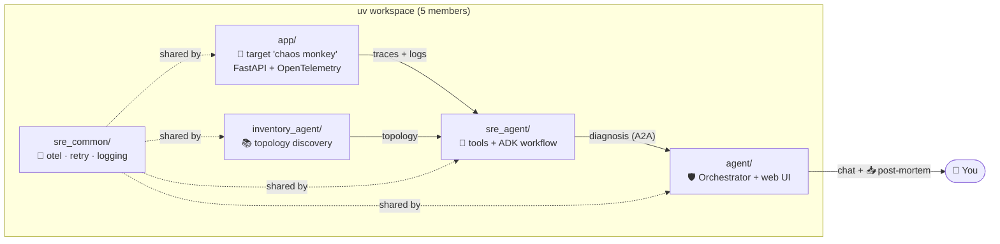
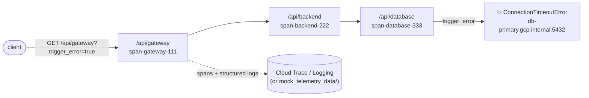
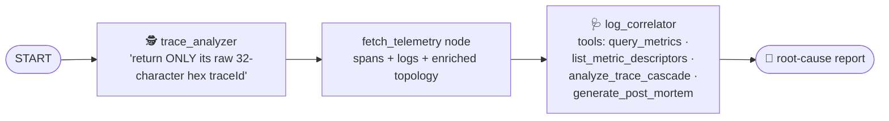
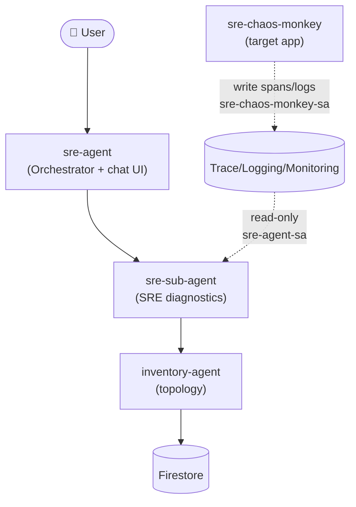

# Codelab: Build a GCP SRE Agent with ADK, A2A, A2UI and Antigravity

This codelab shows how to build a Site Reliability Engineering (SRE) agent. The agent diagnoses
failures in a distributed application. It also writes an incident post-mortem that you can
download.

Each step uses the real packages in this repository. All steps run **locally without GCP
credentials**, because a mock telemetry mode replaces the cloud APIs. Step 8 shows the real
output of the finished project.

> **Tools:** You can use the Antigravity CLI with this project, but it is not necessary. This
> codelab is plain documentation. Use the editor or assistant that you prefer. Obey the rules in
> [`AGENTS.md`](AGENTS.md).

> **📦 Finished code:** The complete project is at
> **[`github.com/xSAVIKx/sre-agent`](https://github.com/xSAVIKx/sre-agent)**. Clone it to compare
> your work with it, or to go to a later step:
> ```bash
> git clone https://github.com/xSAVIKx/sre-agent.git
> ```

---

## 🎯 What You Will Build


```mermaid
flowchart LR
    subgraph WS["uv workspace (5 members)"]
        direction TB
        APP["app/<br/>🐒 target 'chaos monkey'<br/>FastAPI + OpenTelemetry"]
        SRE["sre_agent/<br/>🔬 tools + ADK workflow"]
        AG["agent/<br/>🛡️ Orchestrator + web UI"]
        INV["inventory_agent/<br/>📚 topology discovery"]
        COM["sre_common/<br/>🧰 otel · retry · logging"]
    end
    APP -->|" traces + logs "| SRE
    INV -->|" topology "| SRE
    SRE -->|" diagnosis (A2A) "| AG
    COM -.->|shared by| APP & SRE & AG & INV
    AG -->|" chat + 📥 post-mortem "| User(["👤 You"])
```

This codelab uses these terms:

| Term | Package | What it does |
|:-----|:--------|:-------------|
| Target app | `app/` | A FastAPI service that makes the synthetic incident. |
| SRE agent | `sre_agent/` | Diagnoses incidents. The Cloud Run service name is `sre-sub-agent`. |
| Orchestrator | `agent/` | The agent that you talk to in the web chat. It delegates to the SRE agent. |
| Inventory agent | `inventory_agent/` | Finds the Cloud Run services and databases of the project. |
| Shared library | `sre_common/` | Code that all services use. |
| Surface | – | One A2UI user interface that the chat shows for one result. |

At the end of the codelab, you have:

1. A **FastAPI target app** with OpenTelemetry. It simulates a `Gateway → Backend → Database` call
   chain and writes traces, correlated logs and metrics.
2. **SRE tools** that query Cloud Trace, Cloud Logging and Cloud Monitoring. The tools also find the
   slowest span and write post-mortems. Each tool has a local mock mode.
3. A **Google ADK multi-agent workflow**. One agent selects the trace. A second agent correlates
   the logs.
4. An **Orchestrator** that uses the Antigravity SDK. Its safety policy denies all tools by default
   and allows only the three SRE tools. It also serves the web chat.
5. **A2UI surfaces**: the SRE agent sends each result as user-interface components that the chat
   shows.
6. A **local simulation** and a **Cloud Run deployment** with least privilege.

---

## 🛠️ Prerequisites

- **Python 3.11 or later.** The code uses 3.14-style typing, for example `list[str]` and
  `str | None`.
- The **`uv`** package manager. To install it, run `pip install uv`.
- *Optional, only for cloud deployment:* the **`gcloud` CLI**, logged in to a GCP project that has
  billing.

---

## Step 1: Create the `uv` Workspace

This project uses [`uv`](https://docs.astral.sh/uv/) workspaces. A workspace resolves the
dependencies of all packages together. Each package keeps its own dependencies.

1. Create the root [`pyproject.toml`](pyproject.toml). This excerpt shows the workspace part:

   ```toml
   [project]
   name = "sre-agent-codelab-workspace"
   version = "0.1.0"
   description = "SRE agent trace & log correlation codelab workspace"
   readme = "README.md"
   requires-python = ">=3.11"
   dependencies = []

   [tool.uv.workspace]
   members = ["app", "agent", "sre_agent", "inventory_agent", "sre_common"]
   ```

   Each member is a package with its own `pyproject.toml`. The root file only defines the
   workspace, the `ruff` settings and the development tools.

2. Create the shared virtual environment:

   ```bash
   uv venv
   ```

3. Install the dependencies and link all packages:

   ```bash
   uv sync --all-packages
   ```

> [!TIP]
> **Why `uv`?** `uv` installs workspace dependencies faster than `pip` and `venv`. It also writes
> one lockfile (`uv.lock`) for all five packages, so each installation gets the same versions.

---

## Step 2: The Shared Library (`sre_common`)

The shared library contains the code that all services use. Thus, all services operate in the same
way. [`sre_common`](sre_common) contains:

| Name | Module | Purpose |
|:-----|:-------|:--------|
| `otel_trace`, `start_span` | `sre_common.otel` | OpenTelemetry decorator and context manager for spans. |
| `retry_async`, `retry_sync` | `sre_common.retry` | Retries with exponential backoff for cloud calls that can fail. |
| `setup_logging` | `sre_common.logging` | Structured logging in the same format for all services. |
| `setup_tracing` | `sre_common.tracing` | Exports the spans of a service to Cloud Trace. |
| `TraceContextMiddleware`, `target_project_contextvar` | `sre_common.middleware` | Keeps the trace context and the target project for each request. |
| `call_agent` | `sre_common.a2a_client` | Calls another agent with the A2A protocol. |

The package root exports the decorators:

```python
from sre_common import retry_async, otel_trace
```

The tools and the workflow in the next steps use these functions.

---

## Step 3: The Target App ("Chaos Monkey")

[`app/main.py`](app/main.py) is a FastAPI app with OpenTelemetry. It simulates a request through
three tiers. The query parameter `trigger_error=true` adds a database connection timeout. This
timeout is the synthetic incident that the agent diagnoses.


```mermaid
flowchart LR
    C([client]) -->|" GET /api/gateway?trigger_error=true "| G["/api/gateway<br/>span-gateway-111"]
    G --> B["/api/backend<br/>span-backend-222"]
    B --> D["/api/database<br/>span-database-333"]
    D -->|" trigger_error "| X["💥 ConnectionTimeoutError<br/>db-primary.gcp.internal:5432"]
    G -. " spans + structured logs " .-> O[("Cloud Trace / Logging<br/>(or mock_telemetry_data/)")]
```

The app has two modes:

| Mode | Setting | Behavior |
|:-----|:--------|:---------|
| Mock | `MOCK_GCP=true` (the default) | The tiers call each other in the same process. The app writes trace, log and metric JSON files to `mock_telemetry_data/`. |
| Real | `MOCK_GCP=false` | Each tier sends the W3C `traceparent` header to the next tier over HTTP. The app exports spans to Cloud Trace. |

In mock mode, the timestamp format is important. The millisecond offset must go into the
**seconds and milliseconds** fields of the timestamp. If it goes into the fraction field, the
duration calculation in Step 4 gives incorrect values.

```python
def _ts(ms: int) -> str:
    """Formats an integer millisecond offset as a valid RFC3339 timestamp.

    The value must occupy the seconds + milliseconds fields (e.g. 10270 ms ->
    ``...:10.270Z``). ...
    """
    secs, millis = divmod(ms, 1000)
    return f"2026-06-11T16:00:{secs:02d}.{millis:03d}Z"


# On an injected error, the database tier uses most of the time (a ~10 s connection timeout):
db_duration = 10200 if trigger_error else 30
backend_duration = db_duration + 50
gateway_duration = backend_duration + 20
```

The app also writes `metrics.json`. This file contains the CPU utilization of `sre-chaos-monkey`
and the connection count of the `db-primary` database.

---

## Step 4: The SRE Tools

The Antigravity SDK and ADK make LLM tools from Python functions. They read the **type hints and
the docstring** of each function to make the tool schema. Thus, each tool must have correct type
hints and a clear docstring.

A tool registers itself with a decorator from
[`sre_agent/registry.py`](sre_agent/src/sre_agent/registry.py). This excerpt has no docstrings:

```python
from collections.abc import Callable
from typing import Any


class ToolRegistry:
    def __init__(self) -> None:
        self._tools: list[Callable[..., Any]] = []

    def register(self, func: Callable[..., Any]) -> Callable[..., Any]:
        if func not in self._tools:
            self._tools.append(func)
        return func

    def get_tools(self) -> list[Callable[..., Any]]:
        return self._tools


registry = ToolRegistry()


def register_tool(func: Callable[..., Any]) -> Callable[..., Any]:
    return registry.register(func)
```

All observability tools are in [`sre_agent/gcp_tools.py`](sre_agent/src/sre_agent/gcp_tools.py):

| Tool | Purpose |
|:-----|:--------|
| `query_traces` | Lists recent traces from Cloud Trace. |
| `get_trace_details` | Gets all spans of one trace. |
| `query_logs` | Queries Cloud Logging with a filter. |
| `query_logs_by_trace` | Gets the logs of one trace. |
| `query_metrics` | Queries time series from Cloud Monitoring. |
| `list_metric_descriptors` | Lists the metric types of the project. |
| `analyze_trace_cascade` | Finds the bottleneck span of one trace. |
| `generate_post_mortem` | Writes the post-mortem of one trace. |

**Each tool must obey two rules:**

1. Use the `@register_tool` decorator.
2. Add an `if IS_MOCK:` branch. This branch reads from `mock_telemetry_data/` and does not call the
   cloud.

`analyze_trace_cascade` finds the bottleneck. For each span, it calculates two durations:

- **Inclusive duration**: the wall-clock time of the span, with its children.
- **Exclusive (self) duration**: the inclusive duration minus the time that the children cover.
  When children run at the same time, their overlap counts only once.

The bottleneck is the span with the largest exclusive duration. The helper `_cascade` does the
calculation. This excerpt is shortened:

```python
def _cascade(spans: list[dict[str, Any]]) -> Cascade:
    # Build parent-child relationships and calculate inclusive durations
    span_map = {s["spanId"]: s for s in spans}
    spans = list(span_map.values())  # drop duplicate span IDs
    children_map = {s["spanId"]: [] for s in spans}

    for s in spans:
        parent_id = s.get("parentSpanId")
        if parent_id and parent_id in span_map:
            children_map[parent_id].append(s["spanId"])

    # Calculate inclusive duration for all spans
    inclusive_durations = {}
    for s in spans:
        inclusive_durations[s["spanId"]] = _calculate_duration_ms(s["startTime"], s["endTime"])

    # Calculate exclusive duration for all spans (overlapping children count once)
    exclusive_durations = {}
    for s in spans:
        span_id = s["spanId"]
        child_ids = children_map[span_id]
        covered_ms = _covered_ms(s, [span_map[cid] for cid in child_ids])
        exclusive_durations[span_id] = max(0, inclusive_durations[span_id] - covered_ms)

    # Find the bottleneck (the span with the highest exclusive duration)
    bottleneck_span_id = max(exclusive_durations, key=exclusive_durations.get)

    return Cascade(spans, span_map, children_map, inclusive_durations, exclusive_durations, bottleneck_span_id)


@register_tool
async def analyze_trace_cascade(trace_id: str, project_id: str | None = None) -> str:
    """Analyzes a trace to calculate inclusive vs exclusive duration for each span and locate the bottleneck.

    Args:
        trace_id: The unique hex string identifying the trace (32 characters).
        project_id: The GCP Project ID. If None, uses default project.

    Returns:
        A Markdown report showing trace hierarchy, self-execution time, and the identified bottleneck.
    """
    details_str = await get_trace_details(trace_id, project_id)  # mock or live
    data = json.loads(details_str)
    cascade = _cascade(data.get("spans", []))
    # …format the hierarchy and the bottleneck as a Markdown table…
```

The `generate_post_mortem` tool writes a post-mortem document. The document starts with the
heading `# 🚨 Incident Post-Mortem`. Do not change this heading: the A2UI surface in Step 7 uses it
to find the post-mortem in a report.

---

## Step 5: The ADK Multi-Agent Workflow

[`sre_agent/sre_workflow.py`](sre_agent/src/sre_agent/sre_workflow.py) connects two ADK agents in a
graph:

- The **TraceAnalyzer** (`trace_analyzer`) selects one trace. It has no tools.
- The **LogCorrelator** (`log_correlator`) diagnoses the trace. It has the diagnostic tools.

Between the two agents, the `fetch_telemetry` node gets the spans, the logs and the topology.


```mermaid
flowchart LR
    Start([START]) --> TA["🕵️ trace_analyzer<br/>'return ONLY its raw 32-character hex traceId'"]
    TA --> FT["fetch_telemetry node<br/>spans + logs + enriched topology"]
    FT --> LC["🩺 log_correlator<br/>tools: query_metrics ·<br/>list_metric_descriptors ·<br/>analyze_trace_cascade ·<br/>generate_post_mortem"]
    LC --> Rep(["📄 root-cause report"])
```

This excerpt has shortened instructions:

```python
from google.adk import Agent as AdkAgent
from google.adk import Workflow as AdkWorkflow
from google.adk.workflow import START, node

trace_analyzer = AdkAgent(
    name="trace_analyzer",
    instruction=(
        "You are an SRE trace analyst. You receive the recent requests worth diagnosing, "
        "ranked best candidate first; ... "
        "Return ONLY its raw 32-character hex traceId. ..."
    ),
    model="gemini-3.8-flash",
)

log_correlator = AdkAgent(
    name="log_correlator",
    instruction=(
        "You are a senior SRE debugging assistant. Analyze the trace details "
        "and correlated logs provided. Identify the failing span, the root cause ... "
        "and recommend a mitigation plan. ..."
    ),
    tools=[query_metrics, list_metric_descriptors, analyze_trace_cascade, generate_post_mortem],
    model="gemini-3.8-flash",
)

# Inside _run_adk_diagnostics(), after the @node(name="fetch_telemetry") function:
sre_diagnostics_workflow = AdkWorkflow(
    name="sre_diagnostics_workflow", edges=[(START, trace_analyzer, fetch_telemetry, log_correlator)]
)
```

The function `diagnose` selects one of **two tiers**. Thus, the project always writes a report,
with or without a Gemini API key. `run_sre_diagnostics` calls `diagnose` and returns only the
report text.

```python
async def diagnose(
    traces_json: str, project_id: str | None = None, question: str = "", trace_id: str | None = None
) -> Diagnosis:
    # …select the incident (incidents.find_incident); if there is none, return an "all healthy" report…
    if HAS_ADK and os.environ.get("GEMINI_API_KEY"):
        return await _run_adk_diagnostics(json.dumps(candidates), project_id, incident, question)  # Gemini
    report = await _run_simulated_diagnostics(incident, project_id)  # offline
    return Diagnosis(report, incident.get("traceId"), failed=report.startswith(SIMULATION_FAILURE))
```

| Tier | Condition | How it works |
|:-----|:----------|:-------------|
| ADK | `google-adk` is installed and `GEMINI_API_KEY` is set | Gemini runs the TraceAnalyzer and the LogCorrelator. |
| Simulated | All other cases | Fixed Python code reads the mock files. The result is the same for each run. |

Both tiers end the report with the cascade table and the post-mortem. The A2UI surfaces and the
tests use these two sections.

---

## Step 6: The Orchestrator and the Safety Policy

You do not talk to the SRE agent directly. You talk to the **Orchestrator**
([`agent/src/agent/config.py`](agent/src/agent/config.py)). The Orchestrator does not diagnose. It
only delegates to the SRE agent. Its Antigravity safety policy makes delegation the only thing that
it can do:

```python
def build_safety_policies() -> list[Any]:
    """Returns the Orchestrator's tool-call policies: deny everything, allow delegation."""
    return [deny("*"), allow("list_incidents"), allow("diagnose_sre"), allow("write_post_mortem")]
```

The SRE agent has three A2A skills. The Orchestrator has one allowed tool for each skill:

| Orchestrator tool | SRE agent skill | Result |
|:------------------|:----------------|:-------|
| `list_incidents` | `list_incidents` | The recent failing and slow requests. Fast, with no model calls. |
| `diagnose_sre` | `diagnose_incident` | The root cause of one incident, with a post-mortem at the end. |
| `write_post_mortem` | `write_post_mortem` | The post-mortem of one trace. |

All three tools call `_call_sre_skill`. This function calls the SRE agent with the **A2A
protocol**. In the standalone simulation, no SRE agent service runs. Then the function runs the
same skill in the Orchestrator process. This excerpt is shortened:

```python
@register_tool
async def diagnose_sre(
    prompt: str, project_id: str | None = None, refresh: bool = False, trace_id: str | None = None
) -> str:
    """Delegates root-cause diagnosis of an incident to the SRE Sub-Agent. ..."""
    return await _call_sre_skill("diagnose_incident", prompt, project_id, trace_id, refresh)


async def _call_sre_skill(
    skill: str, prompt: str, project_id: str | None = None, trace_id: str | None = None, refresh: bool = False
) -> str:
    sre_agent_url = os.getenv("SRE_AGENT_URL")
    mock_mode = os.getenv("MOCK_GCP", "false").lower() == "true"
    if mock_mode and not sre_agent_url:
        # Standalone simulation: run the same skill in this process.
        report, surface = await _run_in_process(skill, prompt, project_id, trace_id, ui=sink is not None)
    else:
        # An A2A task: progress arrives as status updates (forwarded to the chat),
        # the result as the task artifact.
        metadata = {"skill": skill, "project_id": ..., "refresh": refresh}
        result = await call_agent(base_url, prompt, metadata, context_id=..., on_progress=_emit_progress, ...)
        report = result.text
    # …store the report and the A2UI surface for the chat UI…
    return report
```

A2A messages do not name a skill. Thus, the Orchestrator puts the skill name in the request
metadata.

The SRE agent is a custom ADK agent. ADK's `to_a2a()` serves it over A2A. `to_a2a()` also publishes
the agent card at `/.well-known/agent-card.json`. The card lists the three skills. See
[`sre_agent/a2a_agent.py`](sre_agent/src/sre_agent/a2a_agent.py):

```python
to_a2a(sre_diagnostics_agent, agent_card=build_agent_card(public_url))
```

All messages from the web chat go to the Orchestrator. No other path sends prompts directly to the
SRE agent. The model selects a tool, and the policy allows or denies the call. While the tool runs,
the chat shows the progress messages from the SRE agent.

> [!IMPORTANT]
> The Antigravity runtime enforces the deny-by-default policy. Thus, the Orchestrator cannot read
> files, run shell commands or call URLs. The least-privilege design is part of the structure. Do
> not relax this policy (see [`AGENTS.md`](AGENTS.md)).

---

## Step 7: Show Results with A2UI

Markdown is good for a terminal and for the model of the Orchestrator. For people, the chat shows a
user interface. The SRE agent sends each result also as an **[A2UI](https://a2ui.org/) v0.9
surface**. A surface is JSON that names components from a catalog. It does not contain HTML.
[`sre_agent/src/sre_agent/a2ui_surfaces.py`](sre_agent/src/sre_agent/a2ui_surfaces.py) has one
function for each type of result:

| Function | Result |
|:---------|:-------|
| `incident_list_surface` | The list of incidents, with Diagnose and Post-mortem buttons on each row. |
| `diagnosis_surface` | A diagnosis: severity, the report in tabs, a Post-mortem button and a Download button. |
| `post_mortem_surface` | A post-mortem: severity, the document in tabs and a Download button. |

These are the components of a post-mortem surface. This excerpt shows the values as they are after
the helper functions run:

```python
components = [
    {"id": "root", "component": "Card", "child": "body"},
    {"id": "body", "component": "Column", "children": ["severity", "title", "trace", "sections", "download"]},
    {"id": "severity", "component": "SeverityBadge", "level": "SEV1", "contribution": 99.3},
    {"id": "title", "component": "Text", "text": "🚨 Incident post-mortem", "variant": "h2"},
    {
        "id": "trace",
        "component": "Text",
        "text": f"Trace {trace_id} · status OPEN until a fix is confirmed",
        "variant": "caption",
    },
    {"id": "sections", "component": "Tabs", "tabs": [{"title": "Post-mortem", "child": "tab-0"}]},
    {"id": "tab-0", "component": "Text", "text": "<the post-mortem Markdown>", "variant": "body"},
    {
        "id": "download",
        "component": "Download",
        "label": "Download",
        "filename": f"post-mortem-{trace_id[:8]}.md",
        "content": report,
    },
]
```

`_messages` puts the components into three A2UI messages: `createSurface`, `updateComponents` and,
when there is data, `updateDataModel`.

* **Catalog.** The surfaces use the SRE catalog. The SRE catalog is the A2UI basic catalog plus two
  custom components: `SeverityBadge` and `Download`.
* **Negotiation.** The agent card of the SRE agent advertises the A2UI extension. For a chat, the
  Orchestrator sends A2UI client capabilities in the request metadata. Without these capabilities,
  the SRE agent sends only Markdown.
* **Transport.** Each A2UI message is one A2A data part. The metadata of the part sets the media
  type `application/json+a2ui`.
* **Rendering.** The browser shows the surfaces with `@a2ui/lit` (see
  [`agent/web/src/sre-a2ui.js`](agent/web/src/sre-a2ui.js)). The chat loads the prebuilt bundle
  `agent/src/agent/static/sre-a2ui.js`. The `Download` component makes the file in the browser with
  the Blob API.
* **Interaction.** Buttons send A2UI actions. For example, "Diagnose" on an incident row comes back
  to the Orchestrator as the next chat turn: "Diagnose trace `<trace ID>`." The safety policy of the
  Orchestrator applies to this turn too.

If you change `agent/web/src/sre-a2ui.js`, build the bundle again:

1. Go to the `agent/web` directory.
2. Run `npm ci`.
3. Run `npm run build`.

---

## Step 8: Run the Local Simulation

This step does not use the cloud or an API key.
[`simulate_incident.py`](simulate_incident.py) does these steps:

1. It deletes the old telemetry in `mock_telemetry_data/`.
2. It triggers the chaos-monkey incident in the target app.
3. It starts the Orchestrator. The Orchestrator calls `diagnose_sre`, which runs the workflow in the
   same process.

Run the simulation:

```bash
uv run simulate_incident.py
```

The output starts with the structured logs of the target app: gateway, backend, then database. The
database log is a `CRITICAL ConnectionTimeoutError`. Then the script prints the short reply of the
Orchestrator (`AGENT REPLY`) and the full report (`AGENT DIAGNOSIS REPORT`). The trace ID changes
for each run. This excerpt is shortened:

```text
==================================================
AGENT DIAGNOSIS REPORT
==================================================
# 🚨 SRE Incident Diagnosis Report

**Anomalous Trace ID**: `1f765c576bee4066a7ea8cbb146a3ded`
**Root Service**: `gateway`
...
## 📊 Observability Metrics
- **CPU Utilization (sre-chaos-monkey)**: `24.0% (Healthy)`
- **Database Connections (db-primary)**: `100 connections (Warning: Max capacity reached)`
...
## ⛓️ Multi-Service Cascade Latency & Bottleneck Analysis
**Trace ID**: `1f765c576bee4066a7ea8cbb146a3ded`
**Total Trace Duration**: `10270 ms`

### 🔍 Span Latency Breakdown
| Service / Span Name | Span ID | Parent ID | Status | Inclusive Time | Exclusive (Self) Time | Contribution |
| :--- | :--- | :--- | :--- | :--- | :--- | :--- |
| `/api/gateway` | `span-gateway-111` | `None` | **ERROR** | 10270 ms | 20 ms | 0.2% |
| &nbsp;&nbsp;└── `/api/backend` | `span-backend-222` | `span-gateway-111` | **ERROR** | 10250 ms | 50 ms | 0.5% |
| &nbsp;&nbsp;&nbsp;&nbsp;└── `/api/database` | `span-database-333` | `span-backend-222` | **ERROR** | 10200 ms | 10200 ms | 99.3% |

### 🚨 Identified Bottleneck
*   **Bottleneck Span**: `/api/database` (`span-database-333`)
*   **Self-Execution Time**: `10200 ms` (99.3% of total trace)
*   **Status**: `ERROR`
*   **Error Message**: `ConnectionTimeoutError: Failed to connect to db-primary.gcp.internal:5432 after 10000ms`

# 🚨 Incident Post-Mortem

## 📝 Incident Overview ...
## 🔍 Incident Timeline ...
## 🎯 Root Cause Analysis (RCA) ...
## 🛠️ Next Steps ...
==================================================
```

> [!NOTE]
> **Check these results:**
> - The breakdown table shows that `/api/database` uses **99.3%** of the trace.
> - The bottleneck error is `ConnectionTimeoutError`.
> - The report ends with a complete `# 🚨 Incident Post-Mortem`.
>
> To use the ADK tier with Gemini instead of the simulated tier, set `GEMINI_API_KEY`.

---

## Step 9 (Optional): Package as an Antigravity Skill

The repository also contains a portable copy of the diagnostics code. This copy is an **Antigravity
Agent Skill** in [`skills/sre_incident_solver/`](skills/sre_incident_solver). The Antigravity CLI
and the Antigravity desktop app find skills in this format automatically. A skill is a folder with
a metadata file, `SKILL.md`:

```markdown
---
name: sre_incident_solver
description: Diagnoses distributed service failures in a GCP stack - scans Cloud Trace for slow or failing requests, finds the bottleneck span (inclusive vs. exclusive time), correlates Cloud Logging entries, and writes an incident post-mortem. Use when a developer reports errors, latency spikes, HTTP 5xx failures or outages in their microservices.
---

# SRE Incident Solver
...
```

Skill loaders read the YAML front matter to decide when to use the skill.

`scripts/sync_skill.py` generates the Python modules of the skill from `sre_agent/`. Thus, the
skill and the services always use the same code. Do not edit the copy. After you change
`sre_agent/`, run:

```bash
uv run python scripts/sync_skill.py
```

If the copy is old, the root test suite fails.

---

## Step 10: Deploy to Cloud Run with Least Privilege

For a real deployment, four services run on Cloud Run. Each service account has only the roles
that its service needs.


```mermaid
flowchart TB
    U(["👤 User"]) --> ORCH["sre-agent<br/>(Orchestrator + chat UI)"]
    ORCH --> SUB["sre-sub-agent<br/>(SRE diagnostics)"]
    SUB --> INV["inventory-agent<br/>(topology)"]
    APP["sre-chaos-monkey<br/>(target app)"]
    INV --> FS[("Firestore")]
    APP -. " write spans/logs<br/>sre-chaos-monkey-sa " .-> OBS[("Trace/Logging/Monitoring")]
    OBS -. " read-only<br/>sre-agent-sa " .-> SUB
```

1. Prepare the project. The script is interactive. It logs you in to `gcloud` and sets the
   project. It can link a billing account. It sets the region and the zone, asks for a Gemini API
   key, and writes `.env`:

   ```bash
   ./bootstrap.sh
   ```

2. Deploy. The script enables the APIs, creates the service accounts, grants the roles, and builds
   and deploys the services:

   ```bash
   ./deploy.sh
   ```

`deploy.sh` grants these project roles:

| Service account | Used by | Roles |
|:----------------|:--------|:------|
| `sre-chaos-monkey-sa` | Target app | `cloudtrace.agent`, `logging.logWriter` *(write telemetry only)* |
| `sre-agent-sa` | Orchestrator and SRE agent | `cloudtrace.user`, `logging.viewer`, `monitoring.viewer`, `datastore.user` *(read telemetry)*, `cloudtrace.agent` *(write its own spans)* |
| `inventory-agent-sa` | Inventory agent and its scanner job | `datastore.user`, `run.developer`, `logging.logWriter`, `cloudasset.viewer`, `cloudtrace.agent` |
| `sre-build-sa` | Cloud Build | `run.admin`, `storage.admin`, `artifactregistry.writer`, `logging.logWriter` |

`sre-agent-sa` and `sre-build-sa` can also read the `GEMINI_API_KEY` secret
(`secretmanager.secretAccessor`). `sre-build-sa` can act as the other service accounts
(`iam.serviceAccountUser`), so that it can deploy the services.

---

## Step 11: Verify the Deployment

Cloud Run URLs have the format `https://<service>-<project number>.<region>.run.app`. At the end,
`deploy.sh` prints the URLs and example `curl` commands.

1. Trigger a live incident in the target app:

   ```bash
   curl "https://sre-chaos-monkey-<project number>.<region>.run.app/api/gateway?trigger_error=true"
   ```

2. In your browser, open the chat UI of the Orchestrator:
   `https://sre-agent-<project number>.<region>.run.app/chat`.
3. In the chat, type: "Diagnose the recent latency spikes and generate a post-mortem."
4. Make sure that the result card shows a **Download** button.
5. Click **Download**. Make sure that the browser saves a Markdown file, for example
   `post-mortem-<first 8 characters of the trace ID>.md`.

You can also run a diagnosis without the chat. Send a `POST` request to the `/diagnose` endpoint of
the Orchestrator. `deploy.sh` prints an example `curl` command for this endpoint.

---

## Step 12: Run the Tests

Each package uses the `src/` layout. Thus, put the `src` directory of the package on `PYTHONPATH`
when you run its tests. The root suite in `test/` has an import test for all modules of the
workspace. It also has the tests for `app/`, `inventory_agent/`, `sre_common/` and the skill copy.

1. Run the tests of the SRE agent:

   ```bash
   PYTHONPATH=sre_agent/src uv run python -m unittest discover -s sre_agent/test
   ```

2. Run the tests of the Orchestrator:

   ```bash
   PYTHONPATH=agent/src     uv run python -m unittest discover -s agent/test
   ```

3. Run the root suite:

   ```bash
   uv run python -m unittest discover -s test
   ```

4. Run the linter and the format check. The `ruff` settings are in the root `pyproject.toml`:

   ```bash
   uv run ruff check .
   uv run ruff format --check .
   ```

GitHub Actions runs these checks for each pull request and for each push to `master`
([`.github/workflows/ci.yml`](.github/workflows/ci.yml)). CI also runs `simulate_incident.py` and
makes sure that the A2UI bundle is current.

CI runs the tests on **Python 3.11 and 3.14**:

- 3.11 is the minimum version in `requires-python`.
- 3.14 is the version in the Dockerfiles.

A test on one version only does not find all errors. For example, code that works on 3.14 can fail
on 3.11. CI runs `ruff` one time only. The setting `target-version = "py311"` selects the rules, so
the Python version that runs `ruff` does not change the result.

---

## Step 13: Clean Up

To stop the costs, delete the resources that `deploy.sh` created. `cleanup.sh` deletes:

- The Cloud Run services and the scanner job.
- The Artifact Registry repository.
- The `GEMINI_API_KEY` secret.
- The service accounts and their role bindings.

It can also delete the Firestore database and the local files. Run:

```bash
./cleanup.sh
```

---

🎉 **You completed the codelab.** You instrumented, simulated, diagnosed and deployed an SRE agent.
The agent changes a failed trace into a post-mortem that you can file. For the architecture and the
design decisions, read [`BLOGPOST.md`](BLOGPOST.md).

## 🎓 Next Steps

[`EXERCISES.md`](EXERCISES.md) contains more tasks. They start with small changes to the tools and
end with a fully autonomous capstone. All tasks use the stack from this codelab.
