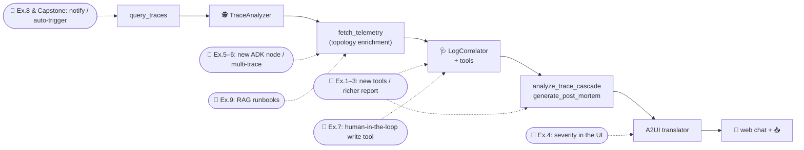

# 🎓 Extend the SRE Agent: Follow-Up Exercises

You've read [`BLOGPOST.md`](BLOGPOST.md) and worked through [`CODELAB.md`](CODELAB.md). You now have
a runnable autonomous SRE agent that scans traces, finds the bottleneck span, correlates logs, and
writes a post-mortem. **This is where it gets fun.**

> **📦 Repo:** all of this lives at
> **[`github.com/xSAVIKx/sre-agent`](https://github.com/xSAVIKx/sre-agent)** — fork it and build
> your extensions on top.

This guide is a set of homework challenges that turn the codelab project into *your* project. Each
one is a real, self-contained feature you can build on top of the existing stack — ordered from
quick warm-ups to a production-grade capstone. Pick whatever scratches your itch.

---

## How to Use This Guide

**Difficulty / effort legend:**

|    | Level                                                         | Typical effort |
|:---|:--------------------------------------------------------------|:---------------|
| 🟢 | Warm-up — extend an existing tool or report                   | 30–60 min      |
| 🟡 | Intermediate — change agent behavior or the workflow graph    | 1–3 hrs        |
| 🔴 | Advanced — new service, RAG, evaluation, or production wiring | half a day+    |

**The five project conventions you must keep** (see [`AGENTS.md`](AGENTS.md)). These aren't
busywork — break them and the agent's planner or the local simulation stops working:

1. **Every tool needs an `if IS_MOCK:` branch** that reads from `mock_telemetry_data/` instead of
   calling the cloud.
2. **Full type hints + a thorough docstring** on every tool — the Antigravity SDK parses them into
   the LLM tool schema.
3. **Register tools with `@register_tool`** (`from sre_agent.registry import register_tool`); never
   hand-append to the config.
4. **Keep the Orchestrator deny-by-default** — only add `allow(...)`/`ask_user(...)` entries
   deliberately.
5. **Wrap external calls** with `@retry_async` and `@otel_trace` from `sre_common`.

**How to verify your work** (do this after every exercise):

```bash
uv run simulate_incident.py                                            # end-to-end smoke test
PYTHONPATH=sre_agent/src uv run python -m unittest discover -s sre_agent/test
PYTHONPATH=agent/src     uv run python -m unittest discover -s agent/test
```

### Where you can plug in



---

## 🟢 Level 1 — Warm-Ups (Tools & Reports)

### Exercise 1 · Make the metrics real 🟢

**Goal.** Run the simulation today and the report says *"No CPU utilization data available."* —
because `simulate_incident.py` never writes a `metrics.json`. Fix that so the **Observability
Metrics** section shows real numbers.

**Start here.** `app/main.py` (write a `metrics.json` alongside the trace/log files when an incident
is generated) and `mock_telemetry_data/`. Mirror the shape that [
`query_metrics`](sre_agent/src/sre_agent/gcp_tools.py) expects (`metric.type`,
`metric.labels.service_name`/`database_id`, `points[].value`) —
`sre_agent/test/test_gcp_tools.py::test_query_metrics_mock` shows the exact schema.

**Hints.** The simulated report in `sre_workflow.py` already queries CPU for `sre-chaos-monkey` and
a connection count for `db-primary`; you just need matching mock points so a saturated DB pool shows
up.

**Done when.** `uv run simulate_incident.py` prints a real CPU % and DB connection count in the
report instead of the "No data" placeholders.

---

### Exercise 2 · Add a log-pattern clustering tool 🟢

**Goal.** A single error message is easy; a *storm* of slightly-different ones is the real signal.
Add a tool `summarize_log_patterns(trace_id | query)` that groups correlated logs by normalized
message (strip IDs/timestamps) and returns the top recurring patterns with counts.

**Start here.** Add the tool to [
`sre_agent/src/sre_agent/gcp_tools.py`](sre_agent/src/sre_agent/gcp_tools.py) next to
`query_logs_by_trace`. Register it, give it an `IS_MOCK` branch, then add it to the
`log_correlator`'s `tools=[...]` list in [
`sre_workflow.py`](sre_agent/src/sre_agent/sre_workflow.py).

**Done when.** A unit test in `sre_agent/test/` proves it clusters a set of mock logs, and the agent
can call it during a diagnosis.

---

### Exercise 3 · Add an SLO / error-budget section to the post-mortem 🟢

**Goal.** Make the post-mortem speak the language of SREs: given the trace's total duration and a
configurable latency SLO (say 1000 ms), compute how badly the request blew the budget and add a **"
SLO Impact"** block.

**Start here.** [`generate_post_mortem`](sre_agent/src/sre_agent/gcp_tools.py). Keep the exact
`# 🚨 Incident Post-Mortem` heading — the [`a2ui_translator`](agent/src/agent/a2ui_translator.py) and
`test_a2ui_translator.py` depend on it.

**Done when.** The generated post-mortem includes a quantified SLO-breach line (e.g. *"10270 ms vs.
1000 ms SLO → 927% over budget"*) and existing tests still pass.

---

### Exercise 4 · Surface severity in the web UI 🟢

**Goal.** Color-code incidents. Map the bottleneck's contribution % to a severity (e.g. ≥90% = SEV1)
and render a colored badge in the chat.

**Start here.** Add a `severity` field where the A2UI components are assembled in [
`a2ui_translator.py`](agent/src/agent/a2ui_translator.py), then render it in the component switch
in [`agent/src/agent/index.html`](agent/src/agent/index.html) (follow the existing `case 'alert':` /
`case 'download_button':` pattern).

**Done when.** A SEV1 incident shows a red badge; a healthy report shows green. Add an assertion to
`test_a2ui_translator.py`.

---

## 🟡 Level 2 — Smarter Diagnosis (Workflow & Agents)

### Exercise 5 · Add a third ADK node: the Mitigation Planner 🟡

**Goal.** Today the graph is `TraceAnalyzer → LogCorrelator`. Add a **MitigationPlanner** agent that
takes the root cause and emits a ranked, actionable remediation plan (with rollback steps),
separating *diagnosis* from *recommendation*.

**Start here.** [`sre_workflow.py`](sre_agent/src/sre_agent/sre_workflow.py) — define a third
`AdkAgent` and extend the `AdkWorkflow` edges. Remember the **two tiers**: also give
`_run_simulated_diagnostics` an equivalent deterministic section so the offline path produces the
same report structure.

**Done when.** Both tiers (with and without `GEMINI_API_KEY`) produce a report containing a
distinct "Mitigation Plan" section, verified via `simulate_incident.py`.

---

### Exercise 6 · Multi-trace incident correlation 🟡

**Goal.** Real incidents span many requests. Instead of diagnosing one trace, detect that *N* recent
traces share a failure signature (same failing span/error) and report it as a single incident with a
blast-radius count.

**Start here.** A new tool over `query_traces` output that buckets traces by failing span + error
class. Feed the summary into the `fetch_telemetry` node in [
`sre_workflow.py`](sre_agent/src/sre_agent/sre_workflow.py).

**Done when.** With several error traces in `mock_telemetry_data/`, the report states something like
*"12 traces affected by the same `/api/database` timeout in the last 2h."*

---

### Exercise 7 · A human-in-the-loop remediation tool (safety!) 🟡

**Goal.** Give the agent the power to *act* — safely. Add a `restart_service(service_name)` (mock)
tool that is **gated behind explicit human confirmation**, exercising Antigravity's `ask_user`
policy hook rather than the blanket `deny`/`allow`.

**Start here.** [`agent/src/agent/config.py`](agent/src/agent/config.py). `ask_user` is already
imported. Add the tool, then add `ask_user("restart_service")` to `safety_policies` — and *
*leave `deny("*")` in place**.

**Done when.** The tool cannot run without confirmation, and you can explain (in a comment or PR
note) why deny-by-default + `ask_user` is safer than simply `allow`-ing it. *This is the most
important exercise for understanding the project's safety model.*

---

### Exercise 8 · Notify a channel (Slack / webhook) 🟡

**Goal.** Close the human loop: when a post-mortem is generated, POST it to a webhook (mockable
locally).

**Start here.** A new tool that uses `httpx` wrapped in `@retry_async`; in `IS_MOCK` mode, write the
payload to a local file instead of making a network call. Reuse the A2A HTTP pattern from
`diagnose_sre` in [`config.py`](agent/src/agent/config.py).

**Done when.** A local mock run records the notification payload to disk; a `WEBHOOK_URL` env var
enables real posting. Bonus: gate it behind `ask_user` like Exercise 7.

---

## 🔴 Level 3 — Close the Loop (Architecture & Production)

### Exercise 9 · RAG over runbooks 🔴

**Goal.** The Inventory agent already does similarity lookup of *diagnostic templates*. Extend that
into retrieval-augmented diagnosis: store org-specific **runbooks** and inject the most relevant one
for the failing service into the LogCorrelator's context.

**Start here.** [`sre_agent/src/sre_agent/itinerary.py`](sre_agent/src/sre_agent/itinerary.py) (
`DEFAULT_TEMPLATES`, `get_embedding`, `find_matching_template`) and the enrichment step in
`fetch_telemetry` ([`sre_workflow.py`](sre_agent/src/sre_agent/sre_workflow.py)). The mock
`get_embedding` returns a zero vector — decide how to make matching meaningful offline (e.g. keyword
fallback when `IS_MOCK`).

**Done when.** A diagnosis for `sre-chaos-monkey` pulls in a matching runbook snippet, and the
workflow still runs with no API key.

---

### Exercise 10 · Go live on real GCP 🔴

**Goal.** Turn off the mocks. Deploy to Cloud Run and diagnose a *real* incident with real Cloud
Trace/Logging/Monitoring data.

**Start here.** `./bootstrap.sh` → `./deploy.sh` (see [`README.md`](README.md) for the
least-privilege service-account matrix), then trigger `curl ".../api/gateway?trigger_error=true"`
and ask the agent in the `/chat` UI.

**Done when.** With `MOCK_GCP=false`, the agent diagnoses a live trace end-to-end. Then run
`./cleanup.sh` to avoid charges. Watch the IAM split do its job: the app SA can only *write*
telemetry, the agent SA can only *read* it.

---

### Exercise 11 · Build an evaluation harness 🔴

**Goal.** How do you know a prompt or model change made the agent *better*? Build a small eval set
of labeled incidents (trace fixtures + expected root cause / bottleneck span) and score the agent's
output automatically.

**Start here.** Add fixtures under `mock_telemetry_data/` and an eval runner that calls
`run_sre_diagnostics` and checks the identified bottleneck span + error class against the label. (
This mirrors ADK's evaluation methodology — an "LLM-as-judge" scorer is a great stretch.)

**Done when.** `make eval` (or a script) reports pass-rate over your incident set, and you can A/B
two agent instructions.

---

### 🏆 Capstone · The fully autonomous loop

**Goal.** Deliver on the blog's promise — *fix it before you even log on.* Wire a Cloud Monitoring
alert → Pub/Sub → an entrypoint that automatically runs the diagnosis and posts the post-mortem to
your channel (Exercise 8), with any remediation gated behind `ask_user` (Exercise 7).

**Start here.** Add a Pub/Sub-push endpoint to the Orchestrator ([
`agent/src/agent/routes.py`](agent/src/agent/routes.py)) that calls the same `diagnose_sre` path the
chat uses; provision the alert + topic in `deploy.sh`.

**Done when.** A triggered incident produces an unattended post-mortem in your channel — no human in
the loop until a remediation needs approval. Record a short demo. 🎬

---

## ✅ Definition of Done (for any exercise)

- [ ] New tools have an `IS_MOCK` branch, full type hints, and a clear docstring.
- [ ] `uv run simulate_incident.py` still produces a complete report (both tiers if you touched the
  workflow).
- [ ] Both unit-test suites pass.
- [ ] The Orchestrator is still deny-by-default; any new capability is a deliberate `allow(...)` /
  `ask_user(...)`.
- [ ] You can explain *why* your change is safe.

Stuck? Re-read the relevant section of [`CODELAB.md`](CODELAB.md), the design rationale in [
`BLOGPOST.md`](BLOGPOST.md), and the conventions in [`AGENTS.md`](AGENTS.md). Now go break
something — safely. 🛠️
