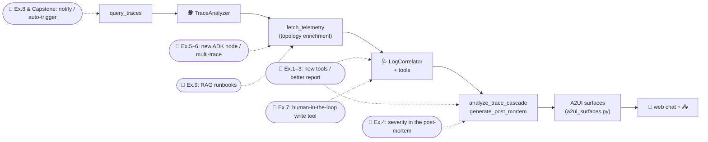

# 🎓 Extend the SRE Agent: Follow-Up Exercises

Read [`BLOGPOST.md`](BLOGPOST.md) and do [`CODELAB.md`](CODELAB.md) before you start. After the
codelab, you have an SRE agent that does these tasks:

- It scans traces.
- It finds the bottleneck span.
- It correlates logs.
- It writes a post-mortem.

> **📦 Repository:** The code is at
> **[`github.com/xSAVIKx/sre-agent`](https://github.com/xSAVIKx/sre-agent)**. Fork the repository
> and add your changes to the fork.

Each exercise adds one feature to the existing stack. The exercises start with small tasks and end
with a production capstone. You can do them in any sequence.

---

## How to Use This Guide

**Levels:**

|    | Level                                                          | Typical time |
|:---|:---------------------------------------------------------------|:-------------|
| 🟢 | Warm-up: change a tool or a report                             | 30–60 min    |
| 🟡 | Intermediate: change the agent behavior or the workflow graph  | 1–3 hours    |
| 🔴 | Advanced: new service, RAG, evaluation or production setup     | half a day or more |

**Obey the five project rules** (see [`AGENTS.md`](AGENTS.md)). If you break a rule, the planner of
the agent or the local simulation stops working.

1. **Each tool must have an `if IS_MOCK:` branch.** This branch reads from `mock_telemetry_data/`
   and does not call the cloud.
2. **Each tool must have full type hints and a clear docstring.** The Antigravity SDK makes the LLM
   tool schema from them.
3. **Register each tool with `@register_tool`**
   (`from sre_agent.registry import register_tool`). Do not add tools to the config manually.
4. **Keep the Orchestrator deny-by-default.** Add an `allow(...)` or `ask_user(...)` rule only when
   you have a reason.
5. **Wrap external calls** with `@retry_async` and `@otel_trace` from `sre_common`.

**Verify your work after each exercise:**

1. Run the end-to-end simulation:

   ```bash
   uv run simulate_incident.py
   ```

2. Run the three test suites. The last suite includes the workspace import test:

   ```bash
   PYTHONPATH=sre_agent/src uv run python -m unittest discover -s sre_agent/test
   PYTHONPATH=agent/src     uv run python -m unittest discover -s agent/test
   uv run python -m unittest discover -s test
   ```

3. Run the linter and the format check:

   ```bash
   uv run ruff check . && uv run ruff format --check .
   ```

CI runs these checks. CI runs the tests on Python 3.11 and on Python 3.14, and `ruff` one time. If
the checks pass on your computer, CI usually passes too.

### Where to Add Your Code


```mermaid
flowchart LR
    Q["query_traces"] --> TA["🕵️ TraceAnalyzer"]
    TA --> FT["fetch_telemetry<br/>(topology enrichment)"]
    FT --> LC["🩺 LogCorrelator<br/>+ tools"]
    LC --> PM["analyze_trace_cascade<br/>generate_post_mortem"]
    PM --> A2["A2UI surfaces<br/>(a2ui_surfaces.py)"] --> UI["💬 web chat + 📥"]
    E1(["🧩 Ex.1–3: new tools / better report"]) -.-> LC & PM
    E2(["🧩 Ex.4: severity in the post-mortem"]) -.-> PM
    E3(["🧩 Ex.5–6: new ADK node / multi-trace"]) -.-> FT
    E4(["🧩 Ex.7: human-in-the-loop write tool"]) -.-> LC
    E5(["🧩 Ex.9: RAG runbooks"]) -.-> FT
    E6(["🧩 Ex.8 & Capstone: notify / auto-trigger"]) -.-> Q
```

---

## 🟢 Level 1: Warm-Ups (Tools and Reports)

### Exercise 1 · Make the metrics tell the truth 🟢

**Goal.** In step 2 of the [workshop](workshop/README.md), the target app started to write
`metrics.json`. Thus, the **Observability Metrics** section of the report shows numbers. But the
verdicts are fixed text: the CPU is always "(Healthy)", and the connection count always shows "Max
capacity reached". Calculate the verdicts from the data.

**Start here.** Go to `_run_simulated_diagnostics` in
[`sre_workflow.py`](sre_agent/src/sre_agent/sre_workflow.py).

1. Compare the latest DB connection count with a pool size that you can configure.
2. Compare the CPU fraction with a threshold.

**Done when.**

- With the healthy readings, the report shows a healthy pool. The healthy readings are the
  `trigger_error=False` series of `_mock_metric_series` in `app/main.py`.
- With the incident readings, the report still shows saturation.
- One unit test covers each case.

Note: `simulate_incident.py` always makes an incident. A healthy trace gives no incident, and the
report then has no metrics section. Thus, test the healthy case with a unit test.

---

### Exercise 2 · Add a log-pattern clustering tool 🟢

**Goal.** One error message is easy to read. Many errors with small differences are a better signal.
Add a tool `summarize_log_patterns(trace_id | query)`. The tool does these steps:

1. It normalizes each correlated log message: it removes IDs and timestamps.
2. It groups the logs by the normalized message.
3. It returns the most frequent patterns with their counts.

**Start here.**

1. Add the tool to [`sre_agent/src/sre_agent/gcp_tools.py`](sre_agent/src/sre_agent/gcp_tools.py),
   near `query_logs_by_trace`.
2. Register the tool with `@register_tool`.
3. Add an `IS_MOCK` branch.
4. Add the tool to the `tools=[...]` list of `log_correlator` in
   [`sre_workflow.py`](sre_agent/src/sre_agent/sre_workflow.py).

**Done when.** A unit test in `sre_agent/test/` shows that the tool groups a set of mock logs. The
agent can call the tool during a diagnosis.

---

### Exercise 3 · Add an SLO / error-budget section to the post-mortem 🟢

**Goal.** Use SRE terms in the post-mortem. Use the total duration of the trace and a latency SLO
that you can configure (for example, 1000 ms). Calculate how much the request went over the
budget. Add an **"SLO Impact"** section with the result.

**Start here.** Go to [`generate_post_mortem`](sre_agent/src/sre_agent/gcp_tools.py). Do not change
the heading `# 🚨 Incident Post-Mortem`. The post-mortem surface in
[`a2ui_surfaces.py`](sre_agent/src/sre_agent/a2ui_surfaces.py) and its tests use this heading.

**Done when.** The post-mortem has a line that gives the SLO breach as a number. For example:
*"10270 ms vs. 1000 ms SLO → 927% over budget"*. The existing tests pass.

---

### Exercise 4 · Carry severity into the post-mortem 🟢

**Goal.** Step 5 of the workshop shows a SEV1, SEV2 or SEV3 badge in the chat. But the post-mortem
file from the **Download** button (`post-mortem-<trace ID prefix>.md`) does not show the severity.
Add the severity to the document.

**Start here.** Go to `classify_severity` in
[`a2ui_surfaces.py`](sre_agent/src/sre_agent/a2ui_surfaces.py) and to `generate_post_mortem` in
[`gcp_tools.py`](sre_agent/src/sre_agent/gcp_tools.py). Do not change the heading
`# 🚨 Incident Post-Mortem`. The post-mortem surface uses it.

**Done when.** The **Incident Overview** section of the downloaded post-mortem has a `Severity`
line. A test covers this line.

---

## 🟡 Level 2: Better Diagnosis (Workflow and Agents)

### Exercise 5 · Add a third ADK node: the Mitigation Planner 🟡

**Goal.** Now the graph is `TraceAnalyzer → fetch_telemetry → LogCorrelator`. Add a
**MitigationPlanner** agent. This agent gets the root cause. It writes a ranked list of remediation
actions, with rollback steps. Thus, the diagnosis and the recommendation are separate.

**Start here.** Go to [`sre_workflow.py`](sre_agent/src/sre_agent/sre_workflow.py).

1. Define a third `AdkAgent`.
2. Add the new agent to the edges of the `AdkWorkflow`.
3. Add an equivalent fixed section to `_run_simulated_diagnostics`. Thus, both **tiers** have the
   same report structure.

**Done when.** Both tiers write a report with a separate "Mitigation Plan" section. Test both tiers
with `simulate_incident.py`: one time with `GEMINI_API_KEY` and one time without it.

---

### Exercise 6 · Multi-trace incident correlation 🟡

**Goal.** A real incident usually affects many requests. Find *N* recent traces with the same
failure signature (the same failing span and error). Report them as one incident, with the number
of affected traces (the blast radius).

**Start here.**

1. Write a new tool that reads the output of `query_traces`.
2. In the tool, group the traces by failing span and error class.
3. Send the summary to the `fetch_telemetry` node in
   [`sre_workflow.py`](sre_agent/src/sre_agent/sre_workflow.py).

**Done when.** Put several error traces in `mock_telemetry_data/`. Run `simulate_incident.py` with
`--keep-data`, so that the script keeps the traces of earlier runs. The report contains a sentence
like *"12 traces affected by the same `/api/database` timeout in the last 2h."*

---

### Exercise 7 · A human-in-the-loop remediation tool (safety!) 🟡

**Goal.** Let the agent *act*, but safely. Add a mock tool `restart_service(service_name)`. The
tool runs only after **explicit human approval**. Use the Antigravity `ask_user` policy, not a
plain `deny` or `allow` rule.

**Start here.** Go to [`agent/src/agent/config.py`](agent/src/agent/config.py). The file already
imports `ask_user`.

1. Add the tool.
2. In `build_safety_policies()`, add the rule `ask_user("restart_service", handler=...)`.
3. **Do not remove `deny("*")`.**
4. Write the handler. The handler receives the pending `ToolCall` and returns `True` to approve the
   call. The real SDK refuses an `ask_user` policy that has no `handler`.
5. Start with a handler that logs the request and returns `False`.
6. Then connect the handler to the chat UI.

**Done when.** The tool cannot run without approval. In a comment or a PR note, explain why
deny-by-default with `ask_user` is safer than `allow`. *This exercise is the most important one to
understand the safety model of the project.*

---

### Exercise 8 · Notify a channel (Slack / webhook) 🟡

**Goal.** Tell the humans about the result. When the agent writes a post-mortem, send it with a
`POST` request to a webhook. In local mock mode, do not send it.

**Start here.**

1. Write a new tool that uses `httpx`. Wrap it in `@retry_async`.
2. In `IS_MOCK` mode, write the payload to a local file. Do not make a network call.
3. For the error handling, look at `_call_sre_skill` in [`config.py`](agent/src/agent/config.py).
   It catches the error and returns a result that starts with `Error:`.

**Done when.** A local mock run writes the notification payload to disk. The environment variable
`WEBHOOK_URL` enables real posts. Optional: put the tool behind an `ask_user` rule, as in
Exercise 7.

---

## 🔴 Level 3: Close the Loop (Architecture and Production)

### Exercise 9 · RAG over runbooks 🔴

**Goal.** The SRE agent already finds *diagnostic templates* with a similarity search. It searches
for each resource that the Inventory agent discovers. Extend this search to retrieval-augmented
diagnosis:

1. Store the **runbooks** of your organization.
2. Find the runbook that matches the failing service best.
3. Add this runbook to the context of the LogCorrelator.

**Start here.** Go to [`sre_agent/src/sre_agent/itinerary.py`](sre_agent/src/sre_agent/itinerary.py)
(`DEFAULT_TEMPLATES`, `get_embedding`, `find_matching_template`). Also go to the enrichment step in
`fetch_telemetry` ([`sre_workflow.py`](sre_agent/src/sre_agent/sre_workflow.py)). In mock mode,
`get_embedding` returns a zero vector. Decide how to get useful matches offline. For example, use a
keyword match when `IS_MOCK` is true.

**Done when.** A diagnosis for `sre-chaos-monkey` includes a part of the matching runbook. The
workflow still runs without an API key.

---

### Exercise 10 · Go live on real GCP 🔴

**Goal.** Stop the mocks. Deploy to Cloud Run. Diagnose a *real* incident with real data from
Cloud Trace, Cloud Logging and Cloud Monitoring.

**Start here.**

1. Run `./bootstrap.sh`.
2. Run `./deploy.sh`. For the least-privilege service accounts, see [`README.md`](README.md).
3. Trigger an incident: `curl ".../api/gateway?trigger_error=true"`.
4. Ask the agent in the `/chat` UI.

**Done when.** With `MOCK_GCP=false`, the agent diagnoses a live trace from start to end. Then run
`./cleanup.sh` to stop the costs. Look at the IAM split: the app service account can only *write*
telemetry. The agent service account can *read* telemetry, and it can write only its own spans.

---

### Exercise 11 · Build an evaluation harness 🔴

**Goal.** Find out if a prompt change or a model change makes the agent *better*. Make a small
evaluation set of labeled incidents. Each incident has trace fixtures and the expected root cause
or bottleneck span. Score the output of the agent automatically.

**Start here.**

1. Add the fixtures to `mock_telemetry_data/`.
2. Write an evaluation runner that calls `run_sre_diagnostics`.
3. In the runner, compare the bottleneck span and the error class with the label.

This method is the same as the ADK evaluation method. Optional: add an "LLM-as-judge" scorer.

**Done when.** A script (or a `make eval` target that you add) shows the pass rate over your
incident set. You can compare two agent instructions (A/B).

---

### 🏆 Capstone · The fully autonomous loop

**Goal.** Fix the incident before a human logs on. Connect these parts:

1. A Cloud Monitoring alert sends a message to Pub/Sub.
2. Pub/Sub calls an entry point that runs the diagnosis automatically.
3. The entry point sends the post-mortem to your channel (Exercise 8).
4. Each remediation needs approval through `ask_user` (Exercise 7).

**Start here.**

1. Add a Pub/Sub push endpoint to the Orchestrator
   ([`agent/src/agent/routes.py`](agent/src/agent/routes.py)). The endpoint calls the same
   `diagnose_sre` tool as the chat. The existing `/diagnose` endpoint is an example.
2. Create the alert and the topic in `deploy.sh`.

**Done when.** An incident produces a post-mortem in your channel without a human. A human is
necessary only when a remediation needs approval. Record a short demo. 🎬

---

## ✅ Definition of Done (for all exercises)

- [ ] Each new tool has an `IS_MOCK` branch, full type hints and a clear docstring.
- [ ] `uv run simulate_incident.py` still writes a complete report. If you changed the workflow,
  test both tiers.
- [ ] All three test suites pass. `ruff check` and `ruff format --check` show no errors.
- [ ] The Orchestrator is still deny-by-default. Each new capability has its own `allow(...)` or
  `ask_user(...)` rule.
- [ ] You can explain *why* your change is safe.

If you have a problem, read the related section of [`CODELAB.md`](CODELAB.md) again. Also read the
design decisions in [`BLOGPOST.md`](BLOGPOST.md) and the rules in [`AGENTS.md`](AGENTS.md).
