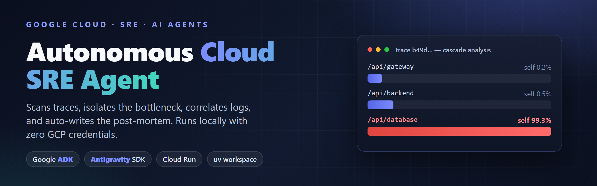
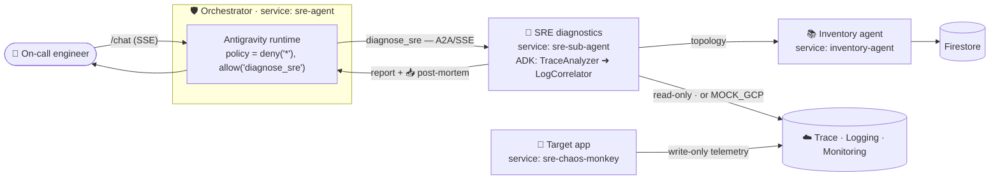

# 🛸 Autonomous Cloud SRE Agent (ADK + Antigravity with `uv`)



Welcome to the production-grade template for building, testing, and deploying an autonomous **Site Reliability Engineering (SRE) Agent** in Google Cloud. This system integrates the **Google Agent Development Kit (ADK)** for multi-agent diagnostic graphs and the **Google Antigravity SDK** for the agent runtime, deny-by-default safety policies, and safe execution.

The agent monitors microservices, queries distributed traces, correlates logs, diagnoses cascade bottlenecks, auto-generates comprehensive incident post-mortems, and lets you download them straight from the chat UI. The whole stack runs **locally with zero GCP credentials** thanks to a mock-telemetry mode.

> **📦 Source code:** [`github.com/xSAVIKx/sre-agent`](https://github.com/xSAVIKx/sre-agent)

**Google Cloud credits are provided for this project.**

#AgenticArchitect #GoogleAntigravity

---

## ⚡ Featured Capabilities

### 1. ⛓️ Multi-Service Cascade Latency & Bottleneck Analyzer
When a request spikes in latency, the SRE Agent dissects the distributed trace. It calculates the **inclusive vs. exclusive (self) execution time** for every span, rendering a contribution table that pins down the exact bottleneck — e.g. a gateway request that looks 10 s slow, where 99.3% of the time is actually trapped in one database span three levels down.

### 2. 📄 Automated Incident Post-Mortem Generator
Following a diagnosis, the agent compiles a complete **Incident Post-Mortem (RCA)** including:
* **Incident Overview**: Date/time, root service, Trace ID, impact duration, and status.
* **Timeline**: Trace timestamps for the gateway alert, cascading failure, and mitigation.
* **Root Cause Analysis**: Connection states, active chaos injections, or infrastructure timeouts.
* **Prevention Plan**: Immediate remediation, short-term workarounds, and long-term preventions.

### 3. 📥 Interactive Chat Downloader
The web chat parses diagnostic reports server-side; when it detects a post-mortem it renders a premium, styled **Download Button** that exports the report to markdown (`post_mortem.md`) entirely client-side via the Blob API.

---

## 🏗️ Architecture

Four FastAPI services collaborate over HTTP (Agent-to-Agent / A2A) with results streamed back as Server-Sent Events (SSE). The user-facing Orchestrator is locked to a **deny-by-default** policy — its only capability is to delegate to the read-only SRE diagnostics agent.



| Service | Package | Role |
| :--- | :--- | :--- |
| Orchestrator | [`agent/`](agent) | User-facing agent + web chat UI; delegates via the `diagnose_sre` tool. |
| SRE diagnostics | [`sre_agent/`](sre_agent) | The engine: observability tools + the ADK multi-agent workflow. |
| Inventory | [`inventory_agent/`](inventory_agent) | Discovers & caches the project topology (Cloud Run services + databases). |
| Target app | [`app/`](app) | OpenTelemetry-instrumented "chaos monkey" that generates synthetic incidents. |
| Shared lib | [`sre_common/`](sre_common) | `otel_trace`, `retry_async`, `setup_logging`, trace-context middleware. |

---

## 📂 Repository Layout

```
.
├── README.md · AGENTS.md · BLOGPOST.md · CODELAB.md
├── pyproject.toml          # Root uv workspace (5 members)
├── uv.lock
├── docker-compose.yaml     # Full local multi-service stack + Firestore emulator
├── cloudbuild.yaml         # Root Cloud Build config
├── bootstrap.sh            # Interactive GCP project setup (writes .env)
├── deploy.sh               # Least-privilege Cloud Run deploy
├── cleanup.sh              # GCP resource teardown
├── simulate_incident.py    # Local standalone simulation (no GCP needed)
│
├── app/                    # 🐒 Target FastAPI app (OpenTelemetry-instrumented)
│   ├── main.py             # Gateway → Backend → Database incident generator
│   ├── Dockerfile · cloudbuild.yaml · pyproject.toml
│
├── agent/                  # 🛡️ Orchestrator service (user-facing + web UI)
│   ├── src/agent/
│   │   ├── config.py           # Antigravity safety policies & runtime loader
│   │   ├── routes.py           # FastAPI endpoints (/chat UI + SSE, /diagnose)
│   │   ├── main.py             # FastAPI app wiring
│   │   ├── a2ui_translator.py  # Markdown → rich A2UI schema (download button)
│   │   ├── firestore_strategy.py
│   │   └── index.html          # Premium web chat interface
│   ├── test/
│   └── Dockerfile · cloudbuild.yaml · pyproject.toml
│
├── sre_agent/              # 🔬 SRE diagnostics engine
│   ├── src/sre_agent/
│   │   ├── gcp_tools.py     # Trace/log/metric tools + cascade & post-mortem
│   │   ├── sre_workflow.py  # ADK multi-agent orchestration (two tiers)
│   │   ├── routes.py        # A2A SSE endpoint /v1/agents/sre/messages
│   │   ├── registry.py      # @register_tool decorator
│   │   ├── itinerary.py · config.py · firestore_strategy.py · main.py
│   ├── test/
│   └── Dockerfile · cloudbuild.yaml · pyproject.toml
│
├── inventory_agent/        # 📚 Infrastructure topology discovery
│   ├── src/inventory_agent/{main,routes,discovery,config,firestore_strategy}.py
│   └── Dockerfile · cloudbuild.yaml · pyproject.toml
│
├── sre_common/             # 🧰 Shared library
│   └── src/sre_common/{otel,retry,logging,middleware}.py
│
└── skills/                 # 🧩 Portable Antigravity skill (mirror of the engine)
    └── sre_incident_solver/{SKILL.md, sre_workflow.py, gcp_tools.py, registry.py}
```

---

## 📖 Key Deliverables

* **Step-by-step Tutorial**: Build the agent from scratch in [`CODELAB.md`](CODELAB.md).
* **Editorial Technical Post**: The engineering architecture & design rationale in [`BLOGPOST.md`](BLOGPOST.md).
* **Contributor Guide**: Conventions for AI and human collaborators in [`AGENTS.md`](AGENTS.md).

---

## 🚀 Quickstart: Local Standalone Simulation

Run the entire diagnostic workflow locally in seconds with **`uv`**. No GCP account, project, or credentials required.

### 1. Clone the Repository
```bash
git clone https://github.com/xSAVIKx/sre-agent.git
cd sre-agent
```

### 2. Synchronize Dependencies
```bash
pip install uv
uv sync --all-packages
```

### 3. Run the Incident Simulation
```bash
uv run simulate_incident.py
```

This single command:
1. Triggers the mock target app gateway to generate a synthetic database-timeout incident.
2. Writes mock traces and logs to `mock_telemetry_data/` (gitignored).
3. Boots the Orchestrator in mock mode, which calls `diagnose_sre` and runs the workflow in-process.
4. Prints the structured telemetry plus the full diagnosis — the **`/api/database` 99.3% bottleneck table** and the complete **`# 🚨 Incident Post-Mortem`** — straight to your terminal.

Want the full multi-service experience (Orchestrator + SRE + Inventory + Firestore emulator + target app) with the web chat UI?

```bash
docker-compose up --build   # then open the chat at /chat
```

---

## ☁️ Production Deployment: Google Cloud Run

Deploy to Cloud Run following least-privilege best practices — each service gets its own minimally-scoped service account.

### 1. Bootstrap GCP Settings
```bash
./bootstrap.sh   # gcloud auth login, set project + region, write .env
```

### 2. Deploy the Services
```bash
./deploy.sh
```
This enables the required APIs (Run, Cloud Build, Trace, Logging, Monitoring, Artifact Registry, Firestore, Secret Manager), provisions the service accounts, grants least-privilege roles, then builds and deploys four Cloud Run services:

| Service account | Used by | Roles |
| :--- | :--- | :--- |
| `sre-chaos-monkey-sa` | target app (`sre-chaos-monkey`) | `cloudtrace.agent`, `logging.logWriter` *(write-only telemetry)* |
| `sre-agent-sa` | SRE diagnostics (`sre-sub-agent`) | `cloudtrace.user`, `logging.viewer`, `monitoring.viewer`, `datastore.user` *(read-only)* |
| `inventory-agent-sa` | inventory agent (`inventory-agent`) | `datastore.user`, `run.developer`, `logging.logWriter` |
| `sre-build-sa` | Cloud Build | `run.admin`, `storage.admin`, `artifactregistry.writer`, `logging.logWriter` |

The split is the point: the app that *generates* chaos can only **write** telemetry; the agent that *investigates* it can only **read**.

---

## ⚙️ The Antigravity Ecosystem

This codebase shows three ways to work with the SRE agent:

### 1. The Antigravity SDK
Used programmatically in [`agent/src/agent/config.py`](agent/src/agent/config.py) to configure the Orchestrator: system instructions, registered tools, and a strict deny-by-default safety policy — `[deny("*"), allow("diagnose_sre")]`. The Orchestrator literally cannot read files, run commands, or hit arbitrary URLs; its only move is to delegate to the read-only SRE sub-agent.

### 2. The Antigravity CLI (`agy`)
Developers can drive and inspect the workspace from the terminal. The most direct way to exercise the full diagnostic loop is the local simulation above (`uv run simulate_incident.py`); the CLI also discovers the reusable skill under [`skills/sre_incident_solver/`](skills/sre_incident_solver).

### 3. Antigravity 2.0 (Visual Workspace)
The desktop application auto-discovers skills placed in the `skills/` directory. Opening this repository surfaces the `sre_incident_solver` skill via [`SKILL.md`](skills/sre_incident_solver/SKILL.md), letting you run and audit SRE tasks from a graphical canvas.

---

## 🧹 Tearing Down the Stack
To prevent ongoing billing charges, remove all deployed Cloud Run services, IAM bindings, and service accounts:
```bash
./cleanup.sh
```
