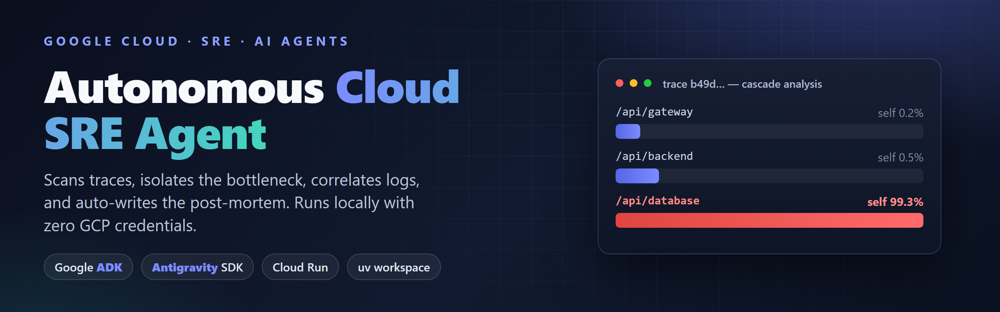
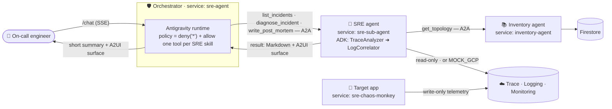

# 🛸 Autonomous Cloud SRE Agent (ADK + Antigravity with `uv`)

[](https://github.com/xSAVIKx/sre-agent/actions/workflows/ci.yml)
[](https://github.com/xSAVIKx/sre-agent/actions/workflows/ci.yml)
[](https://github.com/astral-sh/ruff)
[](LICENSE)



This repository is a demo and workshop project. It shows how to build, test and deploy a
**Site Reliability Engineering (SRE) agent** on Google Cloud. It uses these technologies:

| Technology | Use in this project |
| :--- | :--- |
| Google Agent Development Kit (ADK) | The multi-agent diagnosis workflow in the SRE agent. |
| Google Antigravity SDK | The Orchestrator runtime and its deny-by-default tool policies. |
| Agent2Agent (A2A) protocol, `a2a-sdk` 1.x | All calls from one agent to another agent. |
| A2UI v0.9, rendered with `@a2ui/lit` 0.12 | The result cards (surfaces) in the web chat. |

The SRE agent finds failing and slow requests in distributed traces. It finds the bottleneck span,
correlates logs and metrics, and writes an incident post-mortem. You can download the post-mortem
from the web chat. The full stack runs locally without GCP credentials, because a mock-telemetry
mode replaces the Google Cloud APIs.

> **📦 Source code:** [`github.com/xSAVIKx/sre-agent`](https://github.com/xSAVIKx/sre-agent)

**Google Cloud credits are provided for this project.**

#AgenticArchitect #GoogleAntigravity

---

## ⚡ Capabilities

### 1. ⛓️ Bottleneck analysis
The SRE agent reads the distributed trace of a slow or failing request. For each span, it
calculates the inclusive time and the exclusive (self) time. The result is a contribution table
that shows the bottleneck span. Example: a gateway request takes 10 s, and one database span three
levels down owns 99.3% of that time.

### 2. 📄 Incident post-mortem
The SRE agent writes a post-mortem from the spans and logs of one trace. The post-mortem has these
sections:

| Section | Content |
| :--- | :--- |
| Incident Overview | Date and time, root service, trace ID, impact duration, outcome, bottleneck and status (`OPEN`). |
| Incident Timeline | The request start, the failing spans and the bottleneck span, the error logs, and the request end. |
| Root Cause Analysis (RCA) | The bottleneck, the error message, and a note when the error is a timeout. |
| Next Steps | Numbered actions to fix the incident and to prevent a repeat. |
| Analyst Notes (AI-generated) | Optional. Added only when `GEMINI_API_KEY` is set. |

### 3. 🖼️ Result cards in the chat (A2UI)
Each result comes back as Markdown and as an A2UI surface. The SRE agent builds the surfaces in
[`a2ui_surfaces.py`](sre_agent/src/sre_agent/a2ui_surfaces.py). The web chat renders them with the
prebuilt bundle [`sre-a2ui.js`](agent/src/agent/static/sre-a2ui.js).

| Surface | Content |
| :--- | :--- |
| Incident list | One row for each recent incident, with **Diagnose** and **Post-mortem** buttons. |
| Diagnosis | A severity badge, tabs for the analysis, the bottleneck and the post-mortem, and a **Download** button. |
| Post-mortem | A severity badge, the post-mortem in tabs, and a **Download** button. |

The **Download** button saves the report as a Markdown file (for example `post-mortem-<trace>.md`).
The browser creates the file. A button such as **Diagnose** sends a new chat turn to the
Orchestrator, so the Orchestrator policy also applies to it.

---

## 🏗️ Architecture

The project deploys four services to Cloud Run. The agents talk to each other over the
**[Agent2Agent (A2A) protocol](https://a2a-protocol.org)** (v1.0):

* The SRE agent and the Inventory agent each publish an agent card at
  `/.well-known/agent-card.json`.
* Each call is an A2A task. Progress comes back as status updates. The result is the task artifact.

The Orchestrator is the agent that the user talks to. It has a **deny-by-default** policy. It can
only call the read-only SRE agent, through one tool for each SRE skill.

| Agent | Built with | Served over A2A by | Skill |
| :--- | :--- | :--- | :--- |
| SRE agent | ADK (custom agent + workflow) | ADK `to_a2a()` | `list_incidents` → table + JSON data, `diagnose_incident` → Markdown report, `write_post_mortem` → post-mortem (+ AI notes with a key) |
| Inventory agent | plain Python | `a2a-sdk` `AgentExecutor` | `get_topology` → JSON data artifact |
| Orchestrator | Antigravity SDK | — (A2A **client**, one tool per SRE skill) | — |


```mermaid
flowchart LR
    User(["👤 On-call engineer"]) -->|"/chat (SSE)"| ORCH

    subgraph Safe["🛡️ Orchestrator · service: sre-agent"]
        ORCH["Antigravity runtime<br/>policy = deny('*') + allow one tool per SRE skill"]
    end

    ORCH -->|"list_incidents · diagnose_incident · write_post_mortem — A2A"| SRE["🔬 SRE agent<br/>service: sre-sub-agent<br/>ADK: TraceAnalyzer ➜ LogCorrelator"]
    SRE -->|"get_topology — A2A"| INV["📚 Inventory agent<br/>service: inventory-agent"]
    INV --> FS[("Firestore")]
    SRE -->|"read-only · or MOCK_GCP"| OBS[("☁️ Trace · Logging · Monitoring")]
    APP["🐒 Target app<br/>service: sre-chaos-monkey"] -->|"write-only telemetry"| OBS
    SRE -->|"result: Markdown + A2UI surface"| ORCH -->|"short summary + A2UI surface"| User
```

| Service | Package | Role |
| :--- | :--- | :--- |
| Orchestrator | [`agent/`](agent) | The user-facing agent and the web chat. It calls one tool for each SRE skill and replies with a short summary. |
| SRE agent | [`sre_agent/`](sre_agent) | The diagnostics engine: the observability tools and the ADK multi-agent workflow. |
| Inventory agent | [`inventory_agent/`](inventory_agent) | Finds and caches the project topology (Cloud Run services and databases). |
| Target app | [`app/`](app) | A "chaos monkey" app with OpenTelemetry. It makes synthetic incidents. |
| Shared library | [`sre_common/`](sre_common) | `otel_trace`, `retry_async`, `setup_logging`, the trace-context middleware, tracing setup and the A2A client. |

---

## 📂 Repository Layout

```
.
├── README.md · AGENTS.md · BLOGPOST.md · CODELAB.md · EXERCISES.md
├── pyproject.toml          # Root uv workspace (5 members)
├── uv.lock
├── docker-compose.yaml     # Full local multi-service stack + Firestore emulator
├── cloudbuild.yaml         # Parallel build + deploy of the four services and the scanner job
├── docker/base.Dockerfile  # Shared dependency image that every service builds on
├── scripts/base-image.sh   # Content-addressed tag of that image
├── scripts/sync_skill.py   # Regenerates the skill mirror from sre_agent
├── bootstrap.sh            # Interactive GCP project setup (writes .env)
├── deploy.sh               # Least-privilege Cloud Run deploy
├── cleanup.sh              # GCP resource teardown
├── simulate_incident.py    # Local standalone simulation (no GCP needed)
├── workshop/               # 90-minute workshop: steps, patches and checks
│
├── app/                    # 🐒 Target FastAPI app (OpenTelemetry-instrumented)
│   ├── main.py             # Gateway → Backend → Database incident generator
│   ├── Dockerfile · pyproject.toml
│
├── agent/                  # 🛡️ Orchestrator service (user-facing + web UI)
│   ├── src/agent/
│   │   ├── config.py           # Antigravity tools, safety policies & runtime loader
│   │   ├── routes.py           # FastAPI endpoints (/chat UI + SSE, /diagnose, /sessions)
│   │   ├── main.py             # FastAPI app wiring
│   │   ├── firestore_strategy.py
│   │   ├── static/sre-a2ui.js  # A2UI renderer bundle (@a2ui/lit + SRE catalog), prebuilt
│   │   └── index.html          # Web chat: model replies + A2UI surfaces
│   ├── web/                    # Sources of the renderer bundle (npm ci && npm run build)
│   ├── test/
│   └── Dockerfile · pyproject.toml
│
├── sre_agent/              # 🔬 SRE agent (diagnostics engine)
│   ├── src/sre_agent/
│   │   ├── gcp_tools.py     # Trace/log/metric tools + cascade & post-mortem
│   │   ├── sre_workflow.py  # ADK multi-agent workflow (TraceAnalyzer ➜ LogCorrelator)
│   │   ├── a2a_agent.py     # The engine as an ADK agent, served over A2A (to_a2a)
│   │   ├── a2ui_surfaces.py # A2UI surfaces and the SRE catalog
│   │   ├── diagnosis.py     # Skill pipelines: topology → traces → workflow → report
│   │   ├── post_mortem_analysis.py # Optional AI analyst notes
│   │   ├── routes.py        # REST: /health, /trace
│   │   ├── registry.py      # @register_tool decorator
│   │   ├── incidents.py · inventory_client.py · itinerary.py · config.py · firestore_strategy.py · main.py
│   ├── test/
│   └── Dockerfile · pyproject.toml
│
├── inventory_agent/        # 📚 Infrastructure topology discovery
│   ├── src/inventory_agent/{main,a2a_server,routes,discovery,config,firestore_strategy}.py
│   └── Dockerfile · pyproject.toml
│
├── sre_common/             # 🧰 Shared library
│   └── src/sre_common/{otel,retry,logging,middleware,tracing,a2a_client}.py
│
└── skills/                 # 🧩 Portable Antigravity skill (generated mirror of the engine)
    └── sre_incident_solver/{SKILL.md, requirements.txt, sre_workflow.py, gcp_tools.py, registry.py, ...}
```

---

## 📖 Documents

| Document | Content |
| :--- | :--- |
| [`INSTALL.md`](INSTALL.md) | Install on macOS, Linux or Windows with one command, or let an Antigravity agent do it. |
| [`CODELAB.md`](CODELAB.md) | A step-by-step tutorial that builds the agent from the start. |
| [`BLOGPOST.md`](BLOGPOST.md) | The architecture and the design decisions. |
| [`AGENTS.md`](AGENTS.md) | Rules for AI agents and human contributors. |
| [`workshop/`](workshop/README.md) | A 90-minute workshop. Each step has a tag and a test check. |
| [`EXERCISES.md`](EXERCISES.md) | Follow-up exercises to extend the project. |

---

## 🚀 Quickstart: Local Simulation

Run the full diagnosis workflow on your computer with **`uv`**. You do not need a GCP account,
project or credentials.

1. Install the repository and its dependencies. The installer gets uv and, if necessary, Python.
   See [`INSTALL.md`](INSTALL.md) for the options and for an agent-guided setup.
   ```bash
   # macOS and Linux
   curl -LsSf https://raw.githubusercontent.com/xSAVIKx/sre-agent/master/install.sh | sh
   # Windows (PowerShell)
   powershell -ExecutionPolicy ByPass -c "irm https://raw.githubusercontent.com/xSAVIKx/sre-agent/master/install.ps1 | iex"
   ```
   If you have a clone and uv: `uv sync --all-packages`.
2. Go to the repository: `cd sre-agent`.
3. Run the incident simulation:
   ```bash
   uv run simulate_incident.py
   ```

The simulation does these steps:

1. It deletes the telemetry from earlier runs. To keep it, add `--keep-data`.
2. It calls the gateway of the target app with an error flag. This makes a synthetic database-timeout incident.
3. It writes mock traces and logs to `mock_telemetry_data/` (gitignored).
4. It starts the Orchestrator in mock mode. The Orchestrator starts the SRE agent on a local port
   and calls its `diagnose_incident` skill over A2A.
5. It prints the Orchestrator reply and the full diagnosis. The diagnosis includes the
   **`/api/database` 99.3% bottleneck table** and the **`# 🚨 Incident Post-Mortem`**.

To run the SRE agent without the Orchestrator, add `--engine-only`.

### Full local stack

Use Docker Compose to run all services with the web chat: the Orchestrator, the SRE agent, the
Inventory agent, the Firestore emulator and the target app.

1. Start the stack. `GEMINI_API_KEY` is optional.
   ```bash
   docker compose up --build
   ```
2. Make an incident in the target app:
   ```bash
   curl "http://localhost:8081/api/gateway?trigger_error=true"
   ```
3. Open `http://localhost:8080/chat` and ask: "Diagnose the recent latency spikes".

Without `GEMINI_API_KEY`, the Orchestrator uses simulation code, and the ADK agents of the SRE agent
use a scripted model (`simulated_llm.py`). With `GEMINI_API_KEY`, they use Gemini. In both cases, the chat goes through the Orchestrator
policy and calls the SRE agent over A2A.

---

## 🧪 Development

```bash
uv sync --all-packages

# Tests. Each package uses the src/ + test/ layout, so each needs its own
# src directory on PYTHONPATH; the root suite imports every workspace module.
PYTHONPATH=agent/src     uv run python -m unittest discover -s agent/test
PYTHONPATH=sre_agent/src uv run python -m unittest discover -s sre_agent/test
uv run python -m unittest discover -s test

# Lint and formatting (ruff, configured in the root pyproject.toml).
uv run ruff check .
uv run ruff format --check .
```

To change the chat renderer, edit `agent/web/src/sre-a2ui.js`. Then rebuild the bundle:

```bash
cd agent/web && npm ci && npm run build
```

[CI](.github/workflows/ci.yml) runs on each push and pull request. It has these jobs:

| Job | Checks |
| :--- | :--- |
| `ruff` | `ruff check`, `ruff format --check`, and that the workshop patches are up to date. |
| `tests` | The three test suites and the local simulation, on **Python 3.11 and 3.14**. |
| `A2UI renderer bundle` | That the committed `agent/src/agent/static/sre-a2ui.js` matches a new build. |
| `docker images` | That `docker compose build` builds every image. |

Python 3.11 is the floor that `requires-python` declares. Python 3.14 is the version in the
Dockerfiles. Ruff runs one time only, because `target-version = "py311"` sets its rules.
Dependabot keeps the dependency floors and `uv.lock` current. See
[`.github/dependabot.yml`](.github/dependabot.yml).

---

## ☁️ Deployment to Google Cloud Run

Each service gets its own service account with the minimum roles that it needs.

1. Set up the GCP project. The script runs `gcloud auth login`, sets the project and region, and writes `.env`.
   ```bash
   ./bootstrap.sh
   ```
2. Deploy the services:
   ```bash
   ./deploy.sh
   ```

`deploy.sh` does these steps:

1. It enables the APIs: Run, Cloud Build, Trace, Logging, Monitoring, Artifact Registry, Firestore, Secret Manager and Cloud Asset.
2. It stores `GEMINI_API_KEY` in Secret Manager.
3. It creates the service accounts and grants the roles in the table below.
4. It creates the Artifact Registry repository and the Firestore database.
5. It builds and deploys the four Cloud Run services and the inventory scanner job (Cloud Run job).

| Service account | Used by | Roles |
| :--- | :--- | :--- |
| `sre-chaos-monkey-sa` | target app (`sre-chaos-monkey`) | `cloudtrace.agent`, `logging.logWriter` *(write-only telemetry)* |
| `sre-agent-sa` | Orchestrator + SRE agent | `cloudtrace.user`, `logging.viewer`, `monitoring.viewer`, `datastore.user` *(read telemetry)*, `cloudtrace.agent` *(write only its own spans)*, `secretmanager.secretAccessor` *(on the `GEMINI_API_KEY` secret)* |
| `inventory-agent-sa` | Inventory agent (`inventory-agent`) and its scanner job | `datastore.user`, `run.developer`, `logging.logWriter`, `cloudasset.viewer` *(discovery)*, `cloudtrace.agent` *(its own spans)* |
| `sre-build-sa` | Cloud Build | `run.admin`, `storage.admin`, `artifactregistry.writer`, `logging.logWriter`, `secretmanager.secretAccessor` *(on the `GEMINI_API_KEY` secret)* |

This split is the main safety control. The target app can only **write** telemetry. The agents
that investigate the telemetry can only **read** it.

> ⚠️ **Demo configuration.** All four services use `--allow-unauthenticated`, so the chat and the
> A2A calls work without more setup. Each person with a service URL can use the agents and your
> Gemini quota. After a demo, run `./cleanup.sh`. To keep the services, put them behind IAP or
> IAM-authenticated invocation first.

---

## ⚙️ The Antigravity Ecosystem

You can use the SRE agent in three ways.

### 1. The Antigravity SDK
[`agent/src/agent/config.py`](agent/src/agent/config.py) uses the SDK to configure the
Orchestrator: the system instructions, the tools and a deny-by-default policy:
`[deny("*"), allow("list_incidents"), allow("diagnose_sre"), allow("write_post_mortem")]`.
The Orchestrator cannot read files, run commands or call other URLs. It can only call the
read-only SRE agent.

### 2. The Antigravity CLI (`agy`)
Use the CLI to work with the workspace from a terminal. The CLI finds the skill in
[`.agents/skills/sre_incident_solver/`](.agents/skills/sre_incident_solver). To run the full diagnosis loop, use the
local simulation (`uv run simulate_incident.py`).

### 3. Antigravity 2.0 (Visual Workspace)
The desktop application finds the skills in the `.agents/skills/` directory. When you open this repository,
it shows the `sre_incident_solver` skill from [`SKILL.md`](.agents/skills/sre_incident_solver/SKILL.md).
You can then run and audit SRE tasks in the graphical interface.

---

## 🧹 Teardown
To stop billing, remove the deployed resources. The script deletes the Cloud Run services, the
scanner job, the Artifact Registry repository, the `GEMINI_API_KEY` secret, and the service
accounts with their role bindings. It can also delete the Firestore database and the local data.
```bash
./cleanup.sh
```
