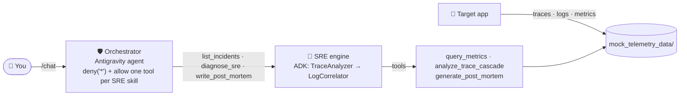

# Workshop: Build an SRE Agent (90 minutes)

In this workshop, you complete an SRE agent that does not work fully yet. You do these tasks:

1. Make the SRE agent find the slowest span in a distributed trace.
2. Give the SRE agent metrics data.
3. Give the Gemini log correlator agent its tools.
4. Set a deny-by-default safety policy on the Orchestrator, which is the agent that users talk to.
5. Show the incident severity in the chat UI.

All steps run **on your laptop**. You do not need a cloud account or an API key.

A `GEMINI_API_KEY` is optional:

* With a key, the agents use Gemini to find the root cause.
* Without a key, each agent uses a deterministic simulation. The report has the same structure.

## Before the workshop (10 minutes, at home)

Install these tools: **git**, **Python 3.11+** and [**uv**](https://docs.astral.sh/uv/getting-started/installation/).

Then do these commands:

```bash
git clone https://github.com/xSAVIKx/sre-agent.git
cd sre-agent
git switch -c my-work step-00      # your own branch, starting at step 0
uv sync --all-packages             # downloads the dependencies (do this on good wifi)
uv run workshop/check.py 0         # checks your setup
```

Optional: `export GEMINI_API_KEY=...` ([get a key](https://aistudio.google.com/apikey)).

## Agenda

| Time      | Step                                                           | File that you change                      |
|:----------|:---------------------------------------------------------------|:------------------------------------------|
| 0:00      | Introduction and live demo                                     | –                                         |
| 0:10      | [0 · Setup and tour](steps/00-setup/README.md)                 | –                                         |
| 0:20      | [1 · Find the bottleneck](steps/01-find-the-bottleneck/README.md) | `sre_agent/.../gcp_tools.py`           |
| 0:32      | [2 · Feed the metrics](steps/02-feed-the-metrics/README.md)    | `app/main.py`                             |
| 0:44      | [3 · Give the agent its tools](steps/03-give-the-agent-tools/README.md) | `sre_agent/.../sre_workflow.py`  |
| 0:54      | [4 · Lock the Orchestrator down](steps/04-lock-it-down/README.md) | `agent/.../config.py`                  |
| 1:06      | [5 · Show the severity](steps/05-show-the-severity/README.md)  | `sre_agent/.../a2ui_surfaces.py`          |
| 1:20      | [6 · Wrap-up: production and next steps](steps/06-wrap-up/README.md) | –                                   |

Each step has a `# TODO(step-N)` comment in the code. To find the comment for step 1, do this command:

```bash
git grep -n "TODO(step-1)"
```

## How the steps work

Each step is a **git tag**:

* `step-00` is the start point. All TODO comments are open.
* `step-03` has the solutions for steps 1, 2 and 3.
* `step-05` is the completed project.

| Task                                     | Command                                                              |
|:-----------------------------------------|:---------------------------------------------------------------------|
| Check your work on step N                | `uv run workshop/check.py N` (red ❌ until you solve it, then green ✅) |
| Check steps 1 to 5                       | `uv run workshop/check.py all`                                       |
| Show the solution for step N             | `git diff step-0<N-1> step-0N -- ':!skills'`                         |
| Apply only the solution for step N       | `git apply workshop/steps/0N-*/solution.patch`                       |
| Go to the start of step N+1              | `git stash && git switch -C catch-up step-0N`                        |
| Start again                              | `git switch -c fresh step-00`                                        |

If you do not use git:

1. Download the repository as a ZIP file from the `workshop` branch.
2. To apply a solution, use `patch -p1 < workshop/steps/0N-*/solution.patch`.

The `solution.patch` files also change `skills/sre_incident_solver/`. This directory is a generated
copy of the SRE agent (see [step 6](steps/06-wrap-up/README.md)). Do not edit it.

## The two commands that you use in all steps

```bash
# Generate an incident and run the diagnosis in your terminal:
uv run simulate_incident.py                 # through the Orchestrator agent (the real path)
uv run simulate_incident.py --engine-only   # straight to the SRE engine (skips the Orchestrator)

# The web chat (no Docker needed), then open http://localhost:8080/chat:
MOCK_GCP=true uv run uvicorn agent.main:app --port 8080
```

## Architecture



In this workshop, "SRE agent" is the diagnostics engine in `sre_agent/`. The diagram and the commands call it "SRE engine".

Facilitators: read [FACILITATOR.md](FACILITATOR.md).
