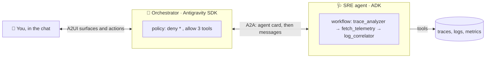

# Basics: ADK, A2A, A2UI and the Antigravity SDK

The workshop uses four technologies. Each page below teaches the basics in about 5 minutes, with
code from this repository and one command to try. The workshop steps build on these basics.

Read the pages before the workshop, or when a step links to them.

| Page | What you learn | Try it | Steps |
|:--|:--|:--|:--|
| [ADK](adk.md) | Build agents: models, instructions, tools and workflows | `uv run workshop/basics/try_adk.py` | 1, 2 |
| [A2A](a2a.md) | Let agents talk to other agents: agent cards, skills, tasks | `uv run workshop/basics/try_a2a.py` | 3, 4 |
| [Antigravity SDK](antigravity.md) | Run an agent with safe limits: policies and hooks | `uv run workshop/basics/try_policy.py` | 4 |
| [A2UI](a2ui.md) | Let agents send UI: surfaces, components, data and actions | The playground: <http://localhost:8080/playground> | 5 |

Before you try the commands, run `uv run simulate_incident.py --engine-only` one time. It makes
an incident for the agents to find.

## The big picture

* **The Antigravity SDK** runs the Orchestrator: the agent that you talk to. Its policy lets it
  call only three tools.
* **A2A** connects the Orchestrator to the SRE agent. They are separate programs, and can be
  separate services.
* **ADK** builds the SRE agent: two model-driven agents and a Python step in a workflow.
* **A2UI** carries the result back as UI: cards, tabs, badges and buttons, not HTML.

## One click, from start to end

You click **Diagnose** on an incident in the chat. This is what happens:

1. **A2UI action.** The button sends an event: `{"name": "diagnose_incident", "context": {"traceId": "…"}}`.
   The chat changes it into a new turn: "Diagnose trace …".
2. **Antigravity.** The Orchestrator's model chooses the tool `diagnose_sre`. The runtime checks
   the policy: `allow("diagnose_sre")`, so the call runs.
3. **A2A request.** The tool reads the SRE agent's card at `/.well-known/agent-card.json`, and
   sends a JSON-RPC `SendStreamingMessage` with the metadata `skill: diagnose_incident`, the trace
   ID, and the A2UI client capabilities of the chat.
4. **ADK workflow.** The SRE agent runs its workflow: the trace analyzer picks the trace, a Python
   step gets the spans and logs, and the log correlator calls tools and writes the root cause.
5. **A2A stream.** While the workflow runs, the SRE agent sends status updates ("Fetching
   traces…"). The chat shows them as progress. At the end, the task has an **artifact**: the
   report as text and as A2UI data parts.
6. **A2UI render.** The chat renders the surface with `@a2ui/lit`: a card with a severity badge,
   tabs and buttons. Each button can start the next click.

## Where to learn more

| Technology | Official documentation |
|:--|:--|
| ADK | <https://google.github.io/adk-docs/> |
| A2A | <https://a2a-protocol.org> |
| A2UI | <https://a2ui.org> |
| Antigravity | <https://antigravity.google/docs> |
