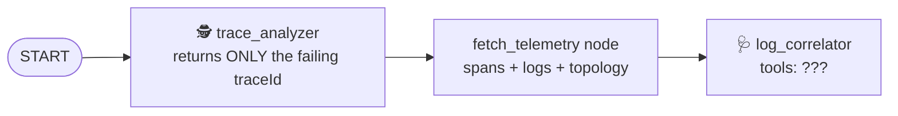

# Step 3 · Give the agent its tools (10 min)

**Goal:** Let the ADK `log_correlator` agent call the tools from steps 1 and 2.

## The idea: an ADK workflow with two agents

`sre_agent/src/sre_agent/sre_workflow.py` connects two Gemini agents in an ADK graph:



* `trace_analyzer` has **no tools**. This is intentional. It selects a trace ID from the data that
  it receives. A small task makes the agent reliable.
* `log_correlator` writes the diagnosis. At this time, it also has **no tools**. With a
  `GEMINI_API_KEY`, it cannot get metrics, so it guesses. It also cannot make the cascade table or
  the post-mortem.

## Your task

1. Find the TODO:

   ```bash
   git grep -n "TODO(step-3)"
   ```

2. Add these tools to the `tools` list of `log_correlator`: `query_metrics`,
   `list_metric_descriptors`, `analyze_trace_cascade` and `generate_post_mortem`.

The file already imports the four tools.

## Run it

```bash
uv run workshop/check.py 3
```

**With a `GEMINI_API_KEY`:**

1. Run `uv run simulate_incident.py --engine-only`.
2. Read the log lines *before* `ADK Workflow completed`. These lines are the tool calls that
   Gemini makes:

   ```text
   sre_tools - INFO - Analyzing cascade for trace: 9093ce73...
   sre_tools - INFO - Generating post-mortem for trace: 9093ce73...
   sre_tools - INFO - [GCP Observability] Querying mock metrics for filter 'metric.type="run.googleapis.com/...
   sre_workflow - INFO - ADK Workflow completed. Appending cascade analysis and post-mortem ...
   ```

Without the tools, no tool lines appear before `ADK Workflow completed`, because the model cannot
call tools. After this line, the workflow adds the cascade table and the post-mortem. Thus, the
report always contains them.

**Without a key:** the SRE agent uses its deterministic simulation. The simulation calls the same
tools in a fixed sequence, so the report is the same. The `check.py 3` test is your proof.

## Discuss

Why do you not give the tools to `trace_analyzer` too?

* Each tool is one more thing that the model can use incorrectly.
* Each tool adds tokens to each model call.

Give each agent the smallest set of tools that it needs for its task. Step 4 applies the same
least-privilege rule to the Orchestrator.

**Stuck?** Run `uv run workshop/step.py hint 3`, or ask the workshop coach in Antigravity. To apply the
solution: `uv run workshop/step.py solve 3`.
