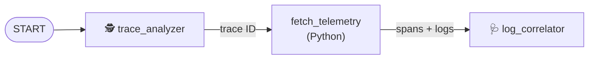

# Step 1 · Connect the agents in a workflow (12 min)

**Goal:** Make the SRE agent run its two ADK agents one after the other, with a code step
between them.

## The idea: an ADK workflow is a graph

The SRE agent (`sre_agent/src/sre_agent/sre_workflow.py`) uses the
[Agent Development Kit (ADK)](https://google.github.io/adk-docs/). It has two agents:

| Agent | Input | Output |
|:--|:--|:--|
| 🕵️ `trace_analyzer` | The recent failing and slow requests | One trace ID |
| 🩺 `log_correlator` | The spans and logs of that trace | The root cause and a mitigation plan |

Between the two agents, a plain Python function, `fetch_telemetry`, gets the spans, the logs and
the project topology for the trace ID. A model is not necessary for this task, so it is code.

An ADK `Workflow` connects these **nodes**. A node can be an agent or a function. A tuple in
`edges` is a chain: each node gets the output of the node before it.



At this time, the chain stops after `trace_analyzer`. The trace ID goes nowhere, and the report
has no root-cause analysis.

### No API key? The agents still run

Without `GEMINI_API_KEY`, the agents use `SimulatedLlm` (`sre_agent/src/sre_agent/simulated_llm.py`).
This is an ADK model class that answers with fixed rules, not with a neural network. The workflow,
the agents and the tool calls are real ADK. Only the text comes from rules. With a key, the same
agents use Gemini.

## Your task

1. Find the TODO:

   ```bash
   git grep -n "TODO(step-1)"
   ```

2. In `_run_adk_diagnostics`, change `edges` to the chain
   `START → trace_analyzer → fetch_telemetry → log_correlator`.

## Run it

1. Do these commands:

   ```bash
   uv run workshop/check.py 1
   uv run simulate_incident.py --engine-only
   ```

2. Find the new sections at the start of the report: **Root Cause Analysis**,
   **Observability Metrics** and **Recommended Mitigation**. The `log_correlator` wrote them.
3. Look at **Observability Metrics**. It says `Not checked: this agent has no query_metrics tool`.
   Step 2 fixes this.

The cascade table and the post-mortem come after the agents' text. The workflow adds them from
the tools, so they are always correct.

## Discuss

* Why is `fetch_telemetry` a function and not an agent? A model is slow, costs money and can make
  mistakes. Use a model only for the decisions that need one.
* Why does `trace_analyzer` return *only* a trace ID? A small, exact output is easy to check: the
  workflow makes sure that the ID is one of the candidates.

**Stuck?** Run `uv run workshop/step.py hint 1`, or ask the workshop coach in Antigravity. To apply
the solution: `uv run workshop/step.py solve 1`.
