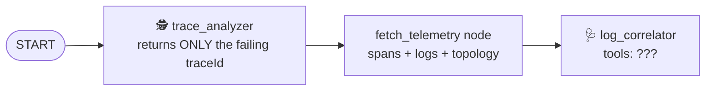

# Step 3 · Give the agent its tools (10 min)

**Goal:** the ADK `log_correlator` agent can call the tools from steps 1 and 2.

## The idea: a two-agent ADK workflow

`sre_agent/src/sre_agent/sre_workflow.py` wires two Gemini agents into an ADK graph:



* `trace_analyzer` has **no tools** on purpose. It picks a trace ID from data it is handed, and a
  narrow job keeps it reliable.
* `log_correlator` writes the diagnosis. Right now it has **no tools either**, so with a
  `GEMINI_API_KEY` it can only guess at metrics, and it can't produce the cascade table or the
  post-mortem.

## Your task

```bash
git grep -n "TODO(step-3)"
```

Give `log_correlator` its toolbelt: `query_metrics`, `list_metric_descriptors`,
`analyze_trace_cascade`, `generate_post_mortem` (all already imported).

## Run it

```bash
uv run workshop/check.py 3
```

**With a `GEMINI_API_KEY`**, run `uv run simulate_incident.py --engine-only` and read the log
lines *before* `ADK Workflow completed`. Those are Gemini's own tool calls:

```text
sre_tools - INFO - Analyzing cascade for trace: 9093ce73...
sre_tools - INFO - Generating post-mortem for trace: 9093ce73...
sre_tools - INFO - [GCP Observability] Querying mock metrics for filter 'metric.type="run.googleapis.com/...
sre_workflow - INFO - ADK Workflow completed. Appending cascade analysis and post-mortem ...
```

Without the toolbelt, nothing appears before that line: the model can only guess. (After it, the
workflow appends the cascade table and post-mortem itself, so the report always has them.)

**Without a key**, the engine uses its deterministic tier, which calls the same tools in a fixed
order, so the report looks the same. The test is your proof.

## Discuss

Why not give `trace_analyzer` the tools too? Every tool is more surface for the model to misuse,
and more tokens on every call. Give each agent the smallest toolbelt that does its job: this is
the same least-privilege idea step 4 applies to the Orchestrator.

**Stuck?** `git apply workshop/steps/03-give-the-agent-tools/solution.patch`
