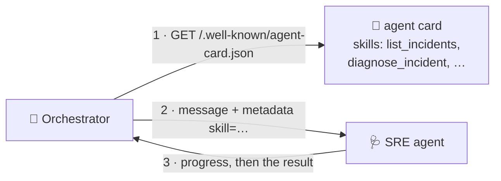

# Step 3 · Publish an A2A skill (12 min)

**Goal:** Make the SRE agent offer a third skill, `write_post_mortem`, to other agents.

**Builds on:** [A2A basics](../../basics/a2a.md): 1. Agent card, 2. Skill, 7. Server and client.

## The idea: agents talk with the A2A protocol

The Orchestrator and the SRE agent are separate agents. They talk with the
[Agent2Agent (A2A) protocol](https://a2a-protocol.org): JSON-RPC over HTTP, with streamed progress.

Each A2A agent publishes an **agent card** at `/.well-known/agent-card.json`. The card says who
the agent is, where to send requests, and which **skills** it has. A client reads the card, then
names a skill in its request.



`sre_agent/src/sre_agent/a2a_agent.py` builds the card, and `to_a2a()` from ADK serves the agent.
`_skill_run` sends each request to the pipeline of its skill.

At this time, the card has two skills, `list_incidents` and `diagnose_incident`. A request for
`write_post_mortem` fails with `Unknown skill`.

## Your task

1. Find the TODOs:

   ```bash
   git grep -n "TODO(step-3)"
   ```

2. In `_skill_run`, run the `WRITE_POST_MORTEM` skill with `run_post_mortem(...)`.
3. In `build_agent_card`, add an `AgentSkill` with `id=WRITE_POST_MORTEM`. Use the two skills
   above it as examples. The `description` is for other agents and their models: say what the
   skill does, and which request metadata it reads (`skill`, `project_id`, `trace_id`).

## Run it

1. Do this command:

   ```bash
   uv run workshop/check.py 3
   ```

2. Start the SRE agent alone:

   ```bash
   uv run uvicorn sre_agent.main:app --port 8081
   ```

3. Open <http://localhost:8081/.well-known/agent-card.json> in your browser. Find your skill.
4. Press Ctrl+C to stop the SRE agent.

The chat cannot use the skill yet: the Orchestrator does not call the SRE agent until step 4.

## Discuss

* Why is the description so long? Another agent's model reads it to decide when to use the skill.
  Write it like a tool docstring.
* Why one skill for each type of answer, and not one skill with a parameter? A client can see the
  skills on the card, and a policy can allow or deny each one (step 4).

**Stuck?** Run `uv run workshop/step.py hint 3`, or ask the workshop coach in Antigravity. To apply
the solution: `uv run workshop/step.py solve 3`.
